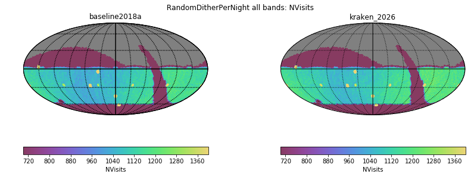
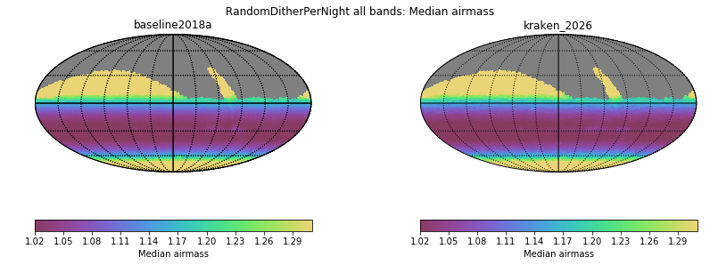
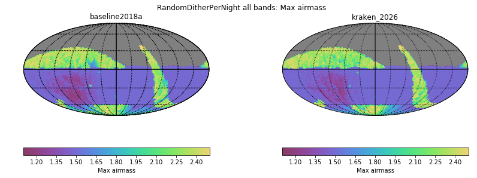
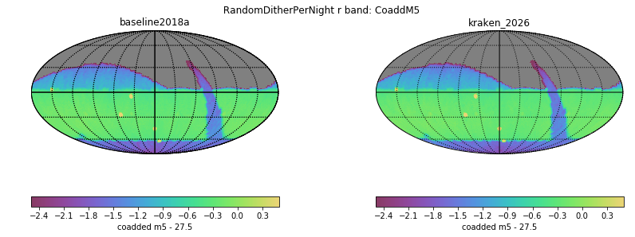
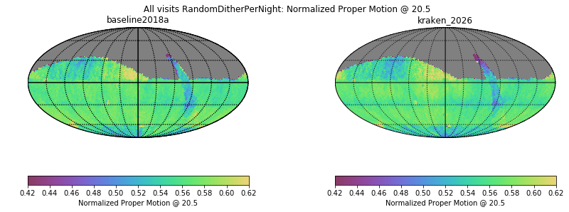
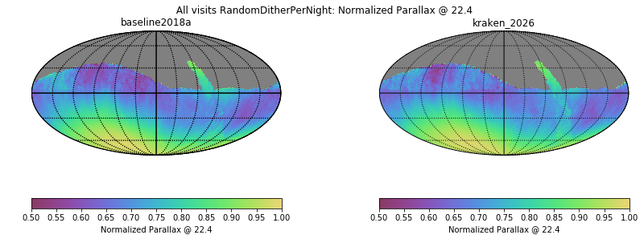
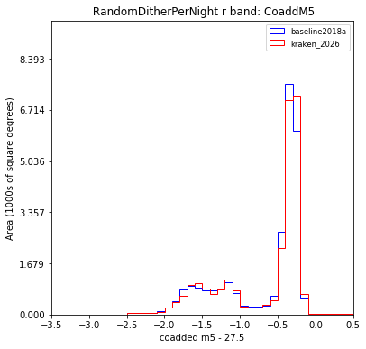
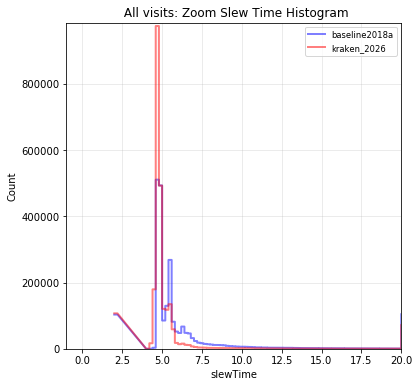

# Table of Contents
1. [fO](#fo)
2. [Total Effective Time](#total-effective-time)
3. [Normalized Effective Time](#normalized-effective-time)
4. [Open Shutter Fraction](#open-shutter-fraction)
5. [Parallax](#parallax)
6. [Proper Motion](#proper-motion)
7. [Rapid Revisit](#rapid-revisit)
8. [Fraction in Pairs](#fraction-in-pairs)
9. [Slews](#slews)
10. [Filter Changes](#filter-changes)
11. [Nvisits](#nvisits)
12. [Proposal Fractions](#proposal-fractions)
13. [Median Nvisits WFD](#median-nvisits-wfd)
14. [Median CoaddM5 WFD](#median-coaddm5-wfd)
15. [Median Airmass WFD](#median-airmass-wfd)
16. [Median Seeing WFD](#median-seeing-wfd)
17. [Skymap comparisons](#skymap-comparisons)
18. [Histrogram comparisons](#histrogram-comparisons)
# fO
|                                                                            |   baseline2018a |   kraken_2026 |
|:---------------------------------------------------------------------------|----------------:|--------------:|
| fOArea fO All visits RandomDitherPerNight HealpixSlicer                    |       17523.6   |     17584     |
| fOArea/benchmark fO All visits RandomDitherPerNight HealpixSlicer          |           0.974 |         0.977 |
| fONv MedianNvis fO All visits RandomDitherPerNight HealpixSlicer           |        1093     |      1125     |
| fONv MinNvis fO All visits RandomDitherPerNight HealpixSlicer              |         621     |       644     |
| fONv/benchmark MedianNvis fO All visits RandomDitherPerNight HealpixSlicer |           1.325 |         1.364 |
| fONv/benchmark MinNvis fO All visits RandomDitherPerNight HealpixSlicer    |           0.753 |         0.781 |
| fOArea fO WFD RandomDitherPerNight HealpixSlicer                           |       17377.6   |     17422.9   |
| fOArea/benchmark fO WFD RandomDitherPerNight HealpixSlicer                 |           0.965 |         0.968 |
| fONv MedianNvis fO WFD RandomDitherPerNight HealpixSlicer                  |        1092     |      1123     |
| fONv MinNvis fO WFD RandomDitherPerNight HealpixSlicer                     |         488     |       504     |
| fONv/benchmark MedianNvis fO WFD RandomDitherPerNight HealpixSlicer        |           1.324 |         1.361 |
| fONv/benchmark MinNvis fO WFD RandomDitherPerNight HealpixSlicer           |           0.592 |         0.611 |

# Total Effective Time
|                                               |   baseline2018a |   kraken_2026 |
|:----------------------------------------------|----------------:|--------------:|
| Total Teff RandomDitherPerNight all bands     |     3.9733e+07  |   4.08386e+07 |
| Total Teff WFD RandomDitherPerNight all bands |     3.59424e+07 |   3.68931e+07 |

# Normalized Effective Time
|                                                                                              |   baseline2018a |   kraken_2026 |
|:---------------------------------------------------------------------------------------------|----------------:|--------------:|
| Median Normalized Teff RandomDitherPerNight all bands RandomDitherPerNight HealpixSlicer     |           0.541 |         0.539 |
| Normalized Teff RandomDitherPerNight all bands RandomDitherPerNight HealpixSlicer            |       32023     |     32009     |
| Normalized Teff RandomDitherPerNight all bands                                               |           0.558 |         0.558 |
| Median Normalized Teff WFD RandomDitherPerNight r band RandomDitherPerNight HealpixSlicer    |           0.476 |         0.473 |
| Normalized Teff WFD RandomDitherPerNight r band RandomDitherPerNight HealpixSlicer           |       22885     |     22895     |
| Median Normalized Teff WFD RandomDitherPerNight y band RandomDitherPerNight HealpixSlicer    |           0.883 |         0.884 |
| Normalized Teff WFD RandomDitherPerNight y band RandomDitherPerNight HealpixSlicer           |       22913     |     22923     |
| Median Normalized Teff WFD RandomDitherPerNight all bands RandomDitherPerNight HealpixSlicer |           0.58  |         0.579 |
| Normalized Teff WFD RandomDitherPerNight all bands RandomDitherPerNight HealpixSlicer        |       22961     |     22964     |
| Normalized Teff WFD RandomDitherPerNight all bands                                           |           0.585 |         0.584 |
| Median Normalized Teff RandomDitherPerNight z band RandomDitherPerNight HealpixSlicer        |           0.412 |         0.411 |
| Normalized Teff RandomDitherPerNight z band RandomDitherPerNight HealpixSlicer               |       31951     |     31953     |
| Median Normalized Teff RandomDitherPerNight y band RandomDitherPerNight HealpixSlicer        |           0.85  |         0.844 |
| Normalized Teff RandomDitherPerNight y band RandomDitherPerNight HealpixSlicer               |       27125     |     27148     |
| Median Normalized Teff WFD RandomDitherPerNight g band RandomDitherPerNight HealpixSlicer    |           0.549 |         0.559 |
| Normalized Teff WFD RandomDitherPerNight g band RandomDitherPerNight HealpixSlicer           |       22807     |     22812     |
| Median Normalized Teff RandomDitherPerNight g band RandomDitherPerNight HealpixSlicer        |           0.506 |         0.518 |
| Normalized Teff RandomDitherPerNight g band RandomDitherPerNight HealpixSlicer               |       31902     |     31914     |
| Median Normalized Teff RandomDitherPerNight r band RandomDitherPerNight HealpixSlicer        |           0.441 |         0.437 |
| Normalized Teff RandomDitherPerNight r band RandomDitherPerNight HealpixSlicer               |       31948     |     31971     |
| Median Normalized Teff WFD RandomDitherPerNight z band RandomDitherPerNight HealpixSlicer    |           0.441 |         0.441 |
| Normalized Teff WFD RandomDitherPerNight z band RandomDitherPerNight HealpixSlicer           |       22866     |     22890     |
| Median Normalized Teff RandomDitherPerNight i band RandomDitherPerNight HealpixSlicer        |           0.569 |         0.57  |
| Normalized Teff RandomDitherPerNight i band RandomDitherPerNight HealpixSlicer               |       31968     |     31941     |
| Median Normalized Teff WFD RandomDitherPerNight i band RandomDitherPerNight HealpixSlicer    |           0.61  |         0.602 |
| Normalized Teff WFD RandomDitherPerNight i band RandomDitherPerNight HealpixSlicer           |       22894     |     22920     |
| Median Normalized Teff WFD RandomDitherPerNight u band RandomDitherPerNight HealpixSlicer    |           0.37  |         0.384 |
| Normalized Teff WFD RandomDitherPerNight u band RandomDitherPerNight HealpixSlicer           |       22844     |     22838     |
| Median Normalized Teff RandomDitherPerNight u band RandomDitherPerNight HealpixSlicer        |           0.356 |         0.37  |
| Normalized Teff RandomDitherPerNight u band RandomDitherPerNight HealpixSlicer               |       27113     |     27109     |

# Open Shutter Fraction
|                                                 |   baseline2018a |   kraken_2026 |
|:------------------------------------------------|----------------:|--------------:|
| OpenShutterFraction All visits                  |           0.716 |         0.735 |
| Median OpenShutterFraction Per night OneDSlicer |           0.718 |         0.739 |
| OpenShutterFraction Per night OneDSlicer        |        3025     |      3025     |

# Parallax
|                                                                                     |   baseline2018a |   kraken_2026 |
|:------------------------------------------------------------------------------------|----------------:|--------------:|
| Median Parallax Error @ 22.4 All visits RandomDitherPerNight HealpixSlicer          |           1.751 |         1.721 |
| Median Parallax Error @ 24.0 All visits RandomDitherPerNight HealpixSlicer          |           6.867 |         6.718 |
| Median Parallax Coverage @ 22.4 All visits RandomDitherPerNight HealpixSlicer       |           0.548 |         0.556 |
| Median Parallax Coverage @ 24.0 All visits RandomDitherPerNight HealpixSlicer       |           0.541 |         0.552 |
| Median Parallax-DCR degeneracy @ 22.4 All visits RandomDitherPerNight HealpixSlicer |           0.229 |         0.245 |
| Median Parallax-DCR degeneracy @ 24.0 All visits RandomDitherPerNight HealpixSlicer |           0.224 |         0.244 |
| Median Parallax Error @ 22.4 WFD RandomDitherPerNight HealpixSlicer                 |           1.599 |         1.574 |
| Median Parallax Error @ 24.0 WFD RandomDitherPerNight HealpixSlicer                 |           6.208 |         6.108 |
| Median Parallax Coverage @ 22.4 WFD RandomDitherPerNight HealpixSlicer              |           0.55  |         0.559 |
| Median Parallax Coverage @ 24.0 WFD RandomDitherPerNight HealpixSlicer              |           0.544 |         0.555 |
| Median Parallax-DCR degeneracy @ 22.4 WFD RandomDitherPerNight HealpixSlicer        |           0.182 |         0.19  |
| Median Parallax-DCR degeneracy @ 24.0 WFD RandomDitherPerNight HealpixSlicer        |           0.176 |         0.187 |

# Proper Motion
|                                                                                 |   baseline2018a |   kraken_2026 |
|:--------------------------------------------------------------------------------|----------------:|--------------:|
| Median Proper Motion Error @ 20.5 All visits RandomDitherPerNight HealpixSlicer |           0.159 |         0.156 |
| Median Proper Motion Error @ 24.0 All visits RandomDitherPerNight HealpixSlicer |           1.725 |         1.693 |
| Median Proper Motion Error @ 20.5 WFD RandomDitherPerNight HealpixSlicer        |           0.155 |         0.152 |
| Median Proper Motion Error @ 24.0 WFD RandomDitherPerNight HealpixSlicer        |           1.622 |         1.585 |

# Rapid Revisit
|                                                                           |   baseline2018a |   kraken_2026 |
|:--------------------------------------------------------------------------|----------------:|--------------:|
| Area (sq deg) RapidRevisits All visits RandomDitherPerNight HealpixSlicer |         27288.6 |       28024.8 |
| Median RapidRevisits All visits RandomDitherPerNight HealpixSlicer        |             1   |           1   |
| RapidRevisits All visits RandomDitherPerNight HealpixSlicer               |         32023   |       32009   |
| Area (sq deg) RapidRevisits WFD RandomDitherPerNight HealpixSlicer        |         37363.2 |       37688.9 |
| Median RapidRevisits WFD RandomDitherPerNight HealpixSlicer               |             1   |           1   |
| RapidRevisits WFD RandomDitherPerNight HealpixSlicer                      |         22961   |       22964   |

# Fraction in Pairs
|                                                                                               |   baseline2018a |   kraken_2026 |
|:----------------------------------------------------------------------------------------------|----------------:|--------------:|
| Median Fraction of visits in pairs (15-60 min) gri WFD+NES RandomDitherPerNight HealpixSlicer |           0.903 |         0.878 |
| Median Fraction of visits in pairs (15-60 min) gri RandomDitherPerNight HealpixSlicer         |           0.896 |         0.869 |

# Slews
|                            |   baseline2018a |   kraken_2026 |
|:---------------------------|----------------:|--------------:|
| Mean slewTime All visits   |           7.92  |         6.789 |
| Median slewTime All visits |           5.175 |         4.792 |
| Min slewTime All visits    |           2     |         2     |
| Max slewTime All visits    |         143     |       156     |

# Filter Changes
|                                                |   baseline2018a |   kraken_2026 |
|:-----------------------------------------------|----------------:|--------------:|
| Filter Changes Whole Survey                    |       10644     |     10813     |
| Filter Changes Per Night OneDSlicer            |        3025     |      3025     |
| Max Filter Changes Per Night OneDSlicer        |          23     |        24     |
| Mean Filter Changes Per Night OneDSlicer       |           3.135 |         3.177 |
| Median Filter Changes Per Night OneDSlicer     |           2     |         2     |
| Min Filter Changes Per Night OneDSlicer        |           0     |         0     |
| N(+3Sigma) Filter Changes Per Night OneDSlicer |          59     |        68     |
| N(-3Sigma) Filter Changes Per Night OneDSlicer |           0     |         0     |
| Rms Filter Changes Per Night OneDSlicer        |           3.471 |         3.578 |

# Nvisits
|                                     |   baseline2018a |    kraken_2026 |
|:------------------------------------|----------------:|---------------:|
| Fraction of total Nvisits All props |      1          |    1           |
| Nvisits All props                   |      2.3727e+06 |    2.43839e+06 |
| Median Nvisits All props OneDSlicer |    785          |  806           |
| Nvisits All props OneDSlicer        |   3025          | 3025           |

# Proposal Fractions
|                                                  |   baseline2018a |   kraken_2026 |
|:-------------------------------------------------|----------------:|--------------:|
| Fraction of total Nvisits All props              |           1     |         1     |
| Fraction of total Nvisits WideFastDeep           |           0.864 |         0.864 |
| Fraction of total Nvisits WFD                    |           0.864 |         0.864 |
| Fraction of total Nvisits SouthCelestialPole     |           0.02  |         0.02  |
| Fraction of total Nvisits GalacticPlane          |           0.016 |         0.016 |
| Fraction of total Nvisits DD                     |           0.046 |         0.046 |
| Fraction of total Nvisits DeepDrillingCosmology1 |           0.046 |         0.046 |
| Fraction of total Nvisits NorthEclipticSpur      |           0.055 |         0.054 |

# Median Nvisits WFD
|                                                                 |   baseline2018a |   kraken_2026 |
|:----------------------------------------------------------------|----------------:|--------------:|
| Median NVisits WFD RandomDitherPerNight r band HealpixSlicer    |             236 |           243 |
| Median NVisits WFD RandomDitherPerNight y band HealpixSlicer    |             219 |           225 |
| Median NVisits WFD RandomDitherPerNight all bands HealpixSlicer |            1085 |          1117 |
| Median NVisits WFD RandomDitherPerNight g band HealpixSlicer    |             103 |           106 |
| Median NVisits WFD RandomDitherPerNight z band HealpixSlicer    |             219 |           223 |
| Median NVisits WFD RandomDitherPerNight i band HealpixSlicer    |             235 |           242 |
| Median NVisits WFD RandomDitherPerNight u band HealpixSlicer    |              74 |            76 |

# Median CoaddM5 WFD
|                                                              |   baseline2018a |   kraken_2026 |
|:-------------------------------------------------------------|----------------:|--------------:|
| Median CoaddM5 WFD RandomDitherPerNight r band HealpixSlicer |          27.266 |        27.28  |
| Median CoaddM5 WFD RandomDitherPerNight y band HealpixSlicer |          24.962 |        24.972 |
| Median CoaddM5 WFD RandomDitherPerNight g band HealpixSlicer |          27.188 |        27.224 |
| Median CoaddM5 WFD RandomDitherPerNight z band HealpixSlicer |          25.785 |        25.796 |
| Median CoaddM5 WFD RandomDitherPerNight i band HealpixSlicer |          26.697 |        26.704 |
| Median CoaddM5 WFD RandomDitherPerNight u band HealpixSlicer |          25.693 |        25.727 |

# Median Airmass WFD
|                                                                        |   baseline2018a |   kraken_2026 |
|:-----------------------------------------------------------------------|----------------:|--------------:|
| Median Median airmass WFD RandomDitherPerNight r band HealpixSlicer    |           1.051 |         1.049 |
| Median Median airmass WFD RandomDitherPerNight y band HealpixSlicer    |           1.085 |         1.086 |
| Median Median airmass WFD RandomDitherPerNight all bands HealpixSlicer |           1.054 |         1.052 |
| Median Median airmass WFD RandomDitherPerNight g band HealpixSlicer    |           1.051 |         1.049 |
| Median Median airmass WFD RandomDitherPerNight z band HealpixSlicer    |           1.061 |         1.054 |
| Median Median airmass WFD RandomDitherPerNight i band HealpixSlicer    |           1.055 |         1.051 |
| Median Median airmass WFD RandomDitherPerNight u band HealpixSlicer    |           1.049 |         1.05  |

# Median Seeing WFD
|                                                                          |   baseline2018a |   kraken_2026 |
|:-------------------------------------------------------------------------|----------------:|--------------:|
| Median Median seeingEff WFD RandomDitherPerNight r band HealpixSlicer    |           0.851 |         0.854 |
| Median Median seeingEff WFD RandomDitherPerNight y band HealpixSlicer    |           0.807 |         0.807 |
| Median Median seeingEff WFD RandomDitherPerNight all bands HealpixSlicer |           0.837 |         0.837 |
| Median Median seeingEff WFD RandomDitherPerNight g band HealpixSlicer    |           0.906 |         0.893 |
| Median Median seeingEff WFD RandomDitherPerNight z band HealpixSlicer    |           0.817 |         0.813 |
| Median Median seeingEff WFD RandomDitherPerNight i band HealpixSlicer    |           0.825 |         0.828 |
| Median Median seeingEff WFD RandomDitherPerNight u band HealpixSlicer    |           0.958 |         0.946 |

# Skymap comparisons
- [Nvisits all bands](figures/kraken_2026_baseline2018a_NVisits_RandomDitherPerNight_all_bands_HEAL_ComboSkyMap.pdf)

- [Nvisits alt/az all bands](figures/kraken_2026_baseline2018a_Nvisits_as_function_of_Alt_Az_all_bands_HEAL_ComboSkyMap.pdf)

- [Median airmass all bands](figures/kraken_2026_baseline2018a_Median_airmass_all_bands_HEAL_ComboSkyMap.pdf)

- [Max airmass all bands](figures/kraken_2026_baseline2018a_Max_airmass_RandomDitherPerNight_all_bands_HEAL_ComboSkyMap.pdf)

- [CoaddM5 r band](figures/kraken_2026_baseline2018a_CoaddM5_RandomDitherPerNight_r_band_HEAL_ComboSkyMap.pdf)

- [Normalized Proper Motion at 20.5](figures/kraken_2026_baseline2018a_Normalized_Proper_Motion_@_20_5_All_visits_RandomDitherPerNight_HEAL_ComboSkyMap.pdf)

- [Normalized Parallax at 22.4](figures/kraken_2026_baseline2018a_Normalized_Parallax_@_22_4_All_visits_RandomDitherPerNight_HEAL_ComboSkyMap.pdf)

# Histrogram comparisons
### CoaddM5 r band HealPix Histrogram

### Slew Distance Histogram

### Zoom Slew Distance Histogram

### Slew Time Histogram

### Zoom Slew Time Histogram 

