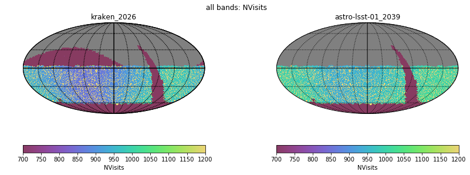
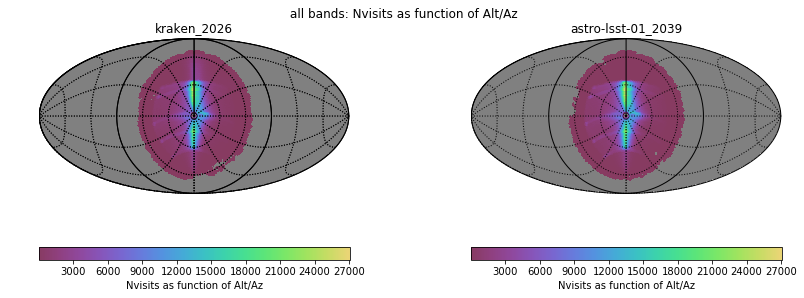
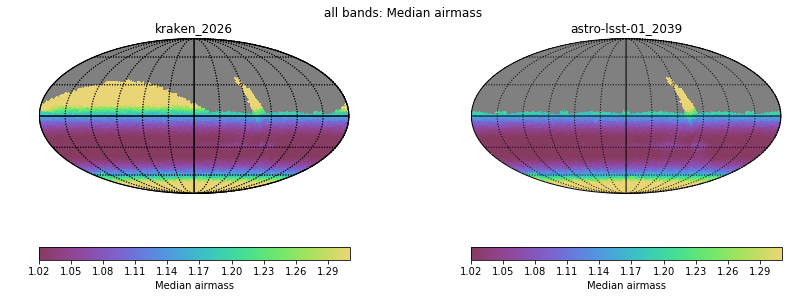
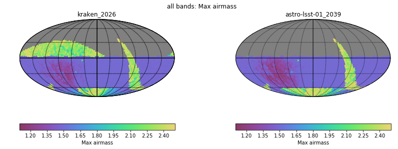
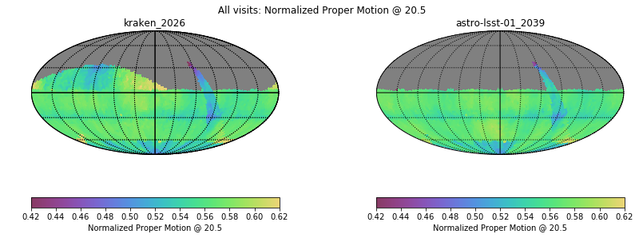
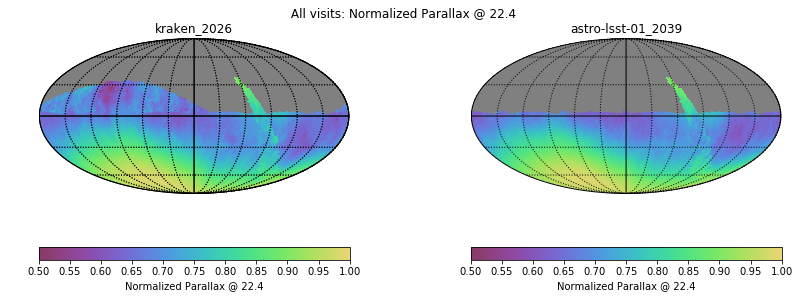
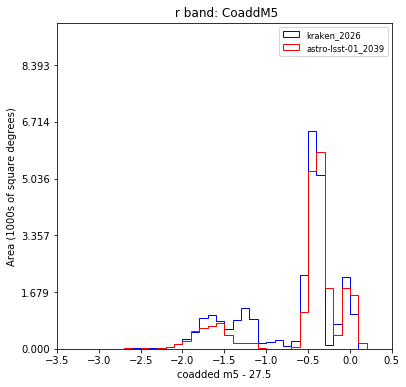
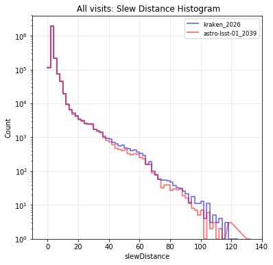
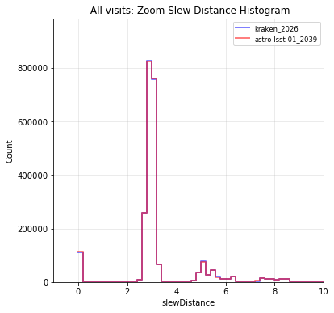
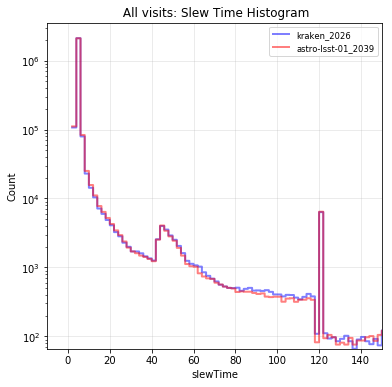

# Table of Contents
1. [fO](#fo)
2. [Total Effective Time](#total-effective-time)
3. [Normalized Effective Time](#normalized-effective-time)
4. [Open Shutter Fraction](#open-shutter-fraction)
5. [Parallax](#parallax)
6. [Proper Motion](#proper-motion)
7. [Rapid Revisit](#rapid-revisit)
8. [Fraction in Pairs](#fraction-in-paris)
9. [Slews](#slews)
10. [Filter Changes](#filter-changes)
11. [Nvisits](#nvisits)
12. [Proposal Fractions](#proposal-fractions)
13. [Median Nvisits WFD](#median-nvisits-wfd)
14. [Median CoaddM5 WFD](#median-coaddm5-wfd)
15. [Median FiveSigmaDepth](#median-fivesigmadepth)
16. [Median Internight Gap](#median-internight-gap)
17. [Median Airmass WFD](#median-airmass-wfd)
18. [Median Seeing WFD](#median-seeing-wfd)
19. [Skymap comparisons](#skymap-comparisons)
20. [Histogram comparisons](#histogram-comparisons)
# fO
|                                                       |   kraken_2026 |   astro-lsst-01_2039 |
|:------------------------------------------------------|--------------:|---------------------:|
| fOArea fO All visits HealpixSlicer                    |     18056.6   |            18056.6   |
| fOArea/benchmark fO All visits HealpixSlicer          |         1.003 |                1.003 |
| fONv MedianNvis fO All visits HealpixSlicer           |       940     |              987     |
| fONv MinNvis fO All visits HealpixSlicer              |       857     |              938     |
| fONv/benchmark MedianNvis fO All visits HealpixSlicer |         1.139 |                1.196 |
| fONv/benchmark MinNvis fO All visits HealpixSlicer    |         1.039 |                1.137 |
| fOArea fO WFD HealpixSlicer                           |     18040.6   |            18040.6   |
| fOArea/benchmark fO WFD HealpixSlicer                 |         1.002 |                1.002 |
| fONv MedianNvis fO WFD HealpixSlicer                  |       938     |              987     |
| fONv MinNvis fO WFD HealpixSlicer                     |       857     |              937     |
| fONv/benchmark MedianNvis fO WFD HealpixSlicer        |         1.137 |                1.196 |
| fONv/benchmark MinNvis fO WFD HealpixSlicer           |         1.039 |                1.136 |

# Total Effective Time
|                          |   kraken_2026 |   astro-lsst-01_2039 |
|:-------------------------|--------------:|---------------------:|
| Total Teff all bands     |   4.08386e+07 |          4.20768e+07 |
| Total Teff WFD all bands |   3.68931e+07 |          3.92383e+07 |

# Normalized Effective Time
|                                                    |   kraken_2026 |   astro-lsst-01_2039 |
|:---------------------------------------------------|--------------:|---------------------:|
| Median Normalized Teff WFD all bands HealpixSlicer |         0.584 |                0.583 |
| Normalized Teff WFD all bands HealpixSlicer        |     21495     |            21495     |
| Normalized Teff WFD all bands                      |         0.584 |                0.586 |

# Open Shutter Fraction
|                                                 |   kraken_2026 |   astro-lsst-01_2039 |
|:------------------------------------------------|--------------:|---------------------:|
| OpenShutterFraction All visits                  |         0.735 |                0.736 |
| Median OpenShutterFraction Per night OneDSlicer |         0.739 |                0.74  |
| OpenShutterFraction Per night OneDSlicer        |      3025     |             3025     |

# Parallax
|                                                                |   kraken_2026 |   astro-lsst-01_2039 |
|:---------------------------------------------------------------|--------------:|---------------------:|
| Median Parallax Error @ 22.4 All visits HealpixSlicer          |         1.816 |                1.657 |
| Median Parallax Error @ 24.0 All visits HealpixSlicer          |         7.066 |                6.467 |
| Median Parallax Coverage @ 22.4 All visits HealpixSlicer       |         0.555 |                0.569 |
| Median Parallax Coverage @ 24.0 All visits HealpixSlicer       |         0.551 |                0.566 |
| Median Parallax-DCR degeneracy @ 22.4 All visits HealpixSlicer |         0.237 |                0.301 |
| Median Parallax-DCR degeneracy @ 24.0 All visits HealpixSlicer |         0.235 |                0.299 |
| Median Parallax Error @ 22.4 WFD HealpixSlicer                 |         1.606 |                1.558 |
| Median Parallax Error @ 24.0 WFD HealpixSlicer                 |         6.175 |                6.04  |
| Median Parallax Coverage @ 22.4 WFD HealpixSlicer              |         0.559 |                0.565 |
| Median Parallax Coverage @ 24.0 WFD HealpixSlicer              |         0.555 |                0.563 |
| Median Parallax-DCR degeneracy @ 22.4 WFD HealpixSlicer        |         0.175 |                0.201 |
| Median Parallax-DCR degeneracy @ 24.0 WFD HealpixSlicer        |         0.172 |                0.191 |

# Proper Motion
|                                                            |   kraken_2026 |   astro-lsst-01_2039 |
|:-----------------------------------------------------------|--------------:|---------------------:|
| Median Proper Motion Error @ 20.5 All visits HealpixSlicer |         0.17  |                0.163 |
| Median Proper Motion Error @ 24.0 All visits HealpixSlicer |         1.813 |                1.69  |
| Median Proper Motion Error @ 20.5 WFD HealpixSlicer        |         0.166 |                0.161 |
| Median Proper Motion Error @ 24.0 WFD HealpixSlicer        |         1.677 |                1.629 |

# Rapid Revisit
|                                                      |   kraken_2026 |   astro-lsst-01_2039 |
|:-----------------------------------------------------|--------------:|---------------------:|
| Area (sq deg) RapidRevisits All visits HealpixSlicer |       10178   |              10737.1 |
| Median RapidRevisits All visits HealpixSlicer        |           0   |                  0   |
| RapidRevisits All visits HealpixSlicer               |       31116   |              26280   |
| Area (sq deg) RapidRevisits WFD HealpixSlicer        |       10757.1 |              11104.4 |
| Median RapidRevisits WFD HealpixSlicer               |           0   |                  0   |
| RapidRevisits WFD HealpixSlicer                      |       21495   |              21495   |

# Fraction in Pairs
|                                                                          |   kraken_2026 |   astro-lsst-01_2039 |
|:-------------------------------------------------------------------------|--------------:|---------------------:|
| Median Fraction of visits in pairs (15-60 min) gri HealpixSlicer         |         0.868 |                0.857 |
| Median Fraction of visits in pairs (15-60 min) gri WFD+NES HealpixSlicer |         0.876 |                0.865 |

# Slews
|                            |   kraken_2026 |   astro-lsst-01_2039 |
|:---------------------------|--------------:|---------------------:|
| Mean slewTime All visits   |         6.789 |                6.746 |
| Median slewTime All visits |         4.792 |                4.797 |
| Min slewTime All visits    |         2     |                2     |
| Max slewTime All visits    |       156     |              156     |

# Filter Changes
|                                                |   kraken_2026 |   astro-lsst-01_2039 |
|:-----------------------------------------------|--------------:|---------------------:|
| Filter Changes Whole Survey                    |     10813     |            10764     |
| Filter Changes Per Night OneDSlicer            |      3025     |             3025     |
| Max Filter Changes Per Night OneDSlicer        |        24     |               27     |
| Mean Filter Changes Per Night OneDSlicer       |         3.177 |                3.164 |
| Median Filter Changes Per Night OneDSlicer     |         2     |                2     |
| Min Filter Changes Per Night OneDSlicer        |         0     |                0     |
| N(+3Sigma) Filter Changes Per Night OneDSlicer |        68     |               76     |
| N(-3Sigma) Filter Changes Per Night OneDSlicer |         0     |                0     |
| Rms Filter Changes Per Night OneDSlicer        |         3.578 |                3.741 |

# Nvisits
|                                     |    kraken_2026 |   astro-lsst-01_2039 |
|:------------------------------------|---------------:|---------------------:|
| Fraction of total Nvisits All props |    1           |          1           |
| Nvisits All props                   |    2.43839e+06 |          2.44098e+06 |
| Median Nvisits All props OneDSlicer |  806           |        807           |
| Nvisits All props OneDSlicer        | 3025           |       3025           |

# Proposal Fractions
|                                                  |   kraken_2026 |   astro-lsst-01_2039 |
|:-------------------------------------------------|--------------:|---------------------:|
| Fraction of total Nvisits All props              |         1     |                1     |
| Fraction of total Nvisits SouthCelestialPole     |         0.02  |                0.021 |
| Fraction of total Nvisits GalacticPlane          |         0.016 |                0.017 |
| Fraction of total Nvisits WFD                    |         0.864 |                0.915 |
| Fraction of total Nvisits DeepDrillingCosmology1 |         0.046 |                0.048 |
| Fraction of total Nvisits DD                     |         0.046 |                0.048 |
| Fraction of total Nvisits WideFastDeep           |         0.864 |                0.915 |

# Median Nvisits WFD
|                                            |   kraken_2026 |   astro-lsst-01_2039 |
|:-------------------------------------------|--------------:|---------------------:|
| Median NVisits WFD i band HealpixSlicer    |           204 |                  216 |
| Median NVisits WFD g band HealpixSlicer    |            90 |                   95 |
| Median NVisits WFD y band HealpixSlicer    |           188 |                  195 |
| Median NVisits WFD u band HealpixSlicer    |            64 |                   67 |
| Median NVisits WFD r band HealpixSlicer    |           206 |                  217 |
| Median NVisits WFD z band HealpixSlicer    |           186 |                  196 |
| Median NVisits WFD all bands HealpixSlicer |           938 |                  986 |

# Median CoaddM5 WFD
|                                         |   kraken_2026 |   astro-lsst-01_2039 |
|:----------------------------------------|--------------:|---------------------:|
| Median CoaddM5 WFD i band HealpixSlicer |        26.618 |               26.679 |
| Median CoaddM5 WFD g band HealpixSlicer |        27.149 |               27.153 |
| Median CoaddM5 WFD y band HealpixSlicer |        24.906 |               24.935 |
| Median CoaddM5 WFD u band HealpixSlicer |        25.651 |               25.674 |
| Median CoaddM5 WFD r band HealpixSlicer |        27.201 |               27.236 |
| Median CoaddM5 WFD z band HealpixSlicer |        25.72  |               25.742 |

# Median FiveSigmaDepth
|                                                          |   kraken_2026 |   astro-lsst-01_2039 |
|:---------------------------------------------------------|--------------:|---------------------:|
| Median Median fiveSigmaDepth WFD i band HealpixSlicer    |        23.691 |               23.709 |
| Median Median fiveSigmaDepth WFD g band HealpixSlicer    |        24.646 |               24.618 |
| Median Median fiveSigmaDepth WFD y band HealpixSlicer    |        21.997 |               22.001 |
| Median Median fiveSigmaDepth WFD u band HealpixSlicer    |        23.337 |               23.319 |
| Median Median fiveSigmaDepth WFD r band HealpixSlicer    |        24.263 |               24.266 |
| Median Median fiveSigmaDepth WFD z band HealpixSlicer    |        22.783 |               22.783 |
| Median Median fiveSigmaDepth WFD all bands HealpixSlicer |        23.492 |               23.507 |

# Median Internight Gap
|                                                           |   kraken_2026 |   astro-lsst-01_2039 |
|:----------------------------------------------------------|--------------:|---------------------:|
| Median Median Inter-Night Gap WFD i band HealpixSlicer    |        10.957 |               10.039 |
| Median Median Inter-Night Gap WFD g band HealpixSlicer    |        25.858 |               25.889 |
| Median Median Inter-Night Gap WFD y band HealpixSlicer    |         3.962 |                3.923 |
| Median Median Inter-Night Gap WFD u band HealpixSlicer    |        23.959 |               23.92  |
| Median Median Inter-Night Gap WFD r band HealpixSlicer    |         7.941 |                6.974 |
| Median Median Inter-Night Gap WFD z band HealpixSlicer    |         5.994 |                4.978 |
| Median Median Inter-Night Gap WFD all bands HealpixSlicer |         1.956 |                1.939 |

# Median Airmass WFD
|                                                   |   kraken_2026 |   astro-lsst-01_2039 |
|:--------------------------------------------------|--------------:|---------------------:|
| Median Median airmass WFD i band HealpixSlicer    |         1.044 |                1.045 |
| Median Median airmass WFD g band HealpixSlicer    |         1.044 |                1.044 |
| Median Median airmass WFD y band HealpixSlicer    |         1.079 |                1.083 |
| Median Median airmass WFD u band HealpixSlicer    |         1.044 |                1.045 |
| Median Median airmass WFD r band HealpixSlicer    |         1.043 |                1.044 |
| Median Median airmass WFD z band HealpixSlicer    |         1.05  |                1.055 |
| Median Median airmass WFD all bands HealpixSlicer |         1.045 |                1.046 |

# Median Seeing WFD
|                                                     |   kraken_2026 |   astro-lsst-01_2039 |
|:----------------------------------------------------|--------------:|---------------------:|
| Median Median seeingEff WFD i band HealpixSlicer    |         0.827 |                0.813 |
| Median Median seeingEff WFD g band HealpixSlicer    |         0.891 |                0.907 |
| Median Median seeingEff WFD y band HealpixSlicer    |         0.805 |                0.806 |
| Median Median seeingEff WFD u band HealpixSlicer    |         0.945 |                0.958 |
| Median Median seeingEff WFD r band HealpixSlicer    |         0.854 |                0.853 |
| Median Median seeingEff WFD z band HealpixSlicer    |         0.811 |                0.814 |
| Median Median seeingEff WFD all bands HealpixSlicer |         0.836 |                0.837 |

# Skymap comparisons
- [Nvisits all bands](figures/astro-lsst-01_2039_kraken_2026_NVisits_all_bands_HEAL_ComboSkyMap.pdf)

- [Nvisits alt/az all bands](figures/astro-lsst-01_2039_kraken_2026_Nvisits_as_function_of_Alt_Az_all_bands_HEAL_ComboSkyMap.pdf)

- [Median airmass all bands](figures/astro-lsst-01_2039_kraken_2026_Median_airmass_all_bands_HEAL_ComboSkyMap.pdf)

- [Max airmass all bands](figures/astro-lsst-01_2039_kraken_2026_Max_airmass_all_bands_HEAL_ComboSkyMap.pdf)

- [CoaddM5 r band](figures/astro-lsst-01_2039_kraken_2026_CoaddM5_r_band_HEAL_ComboSkyMap.pdf)

- [Normalized Proper Motion at 20.5](figures/astro-lsst-01_2039_kraken_2026_Normalized_Proper_Motion_@_20_5_All_visits_HEAL_ComboSkyMap.pdf)

- [Normalized Parallax at 22.4](figures/astro-lsst-01_2039_kraken_2026_Normalized_Parallax_@_22_4_All_visits_HEAL_ComboSkyMap.pdf)

# Histogram comparisons
### CoaddM5 r band HealPix Histogram

### Slew Distance Histogram

### Zoom Slew Distance Histogram

### Slew Time Histogram

### Zoom Slew Time Histogram

