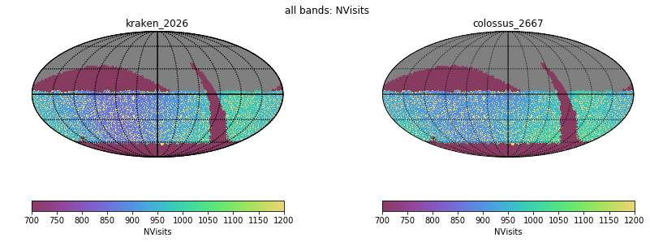
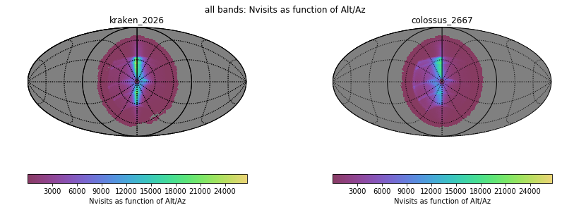
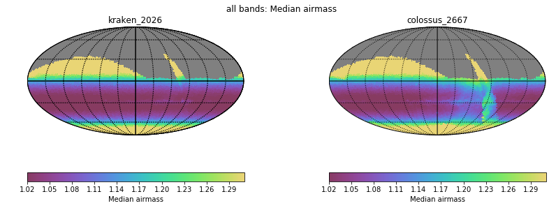
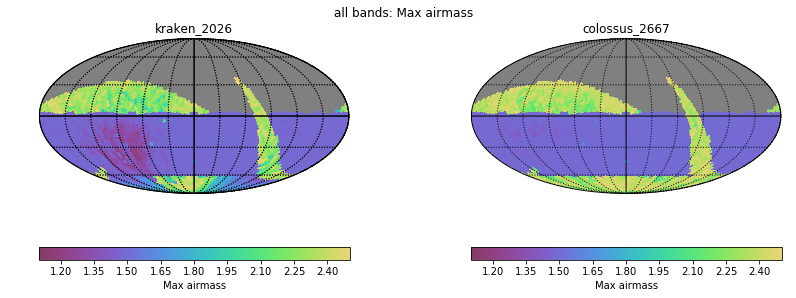
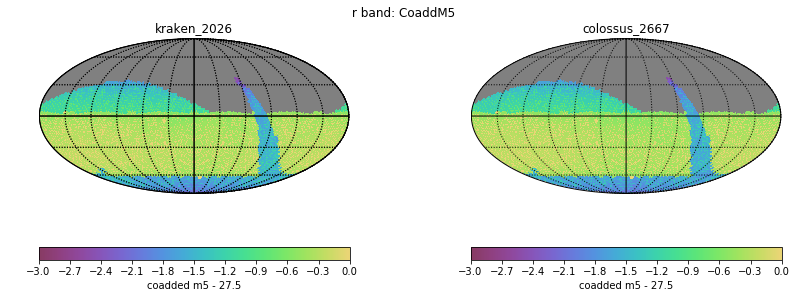
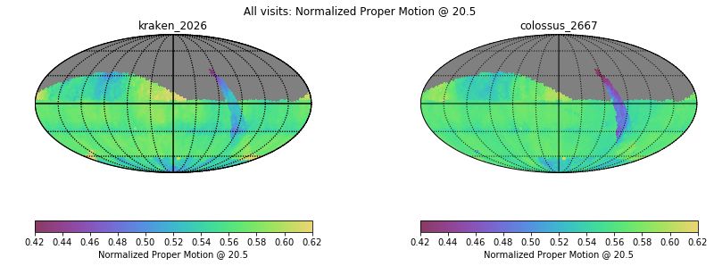
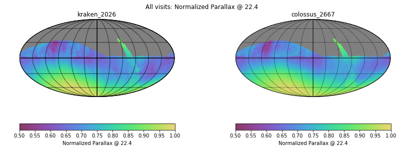
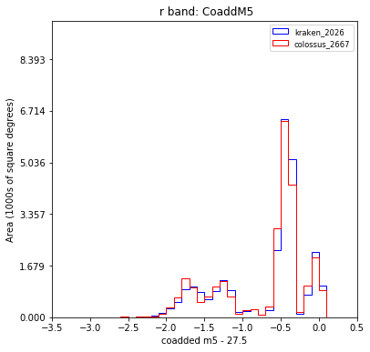
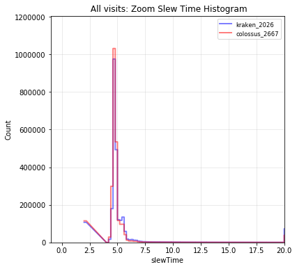

# Table of Contents
1. [fO](#fo)
2. [Total Effective Time](#total-effective-time)
3. [Normalized Effective Time](#normalized-effective-time)
4. [Open Shutter Fraction](#open-shutter-fraction)
5. [Parallax](#parallax)
6. [Proper Motion](#proper-motion)
7. [Rapid Revisit](#rapid-revisit)
8. [Fraction in Pairs](#fraction-in-paris)
9. [Slews](#slews)
10. [Filter Changes](#filter-changes)
11. [Nvisits](#nvisits)
12. [Proposal Fractions](#proposal-fractions)
13. [Median Nvisits WFD](#median-nvisits-wfd)
14. [Median CoaddM5 WFD](#median-coaddm5-wfd)
15. [Median Airmass WFD](#median-airmass-wfd)
16. [Median Seeing WFD](#median-seeing-wfd)
17. [Skymap comparisons](#skymap-comparisons)
18. [Histrogram comparisons](#histrogram-comparisons)
# fO
|                                                       |   kraken_2026 |   colossus_2667 |
|:------------------------------------------------------|--------------:|----------------:|
| fOArea fO All visits HealpixSlicer                    |     18056.6   |       18056.6   |
| fOArea/benchmark fO All visits HealpixSlicer          |         1.003 |           1.003 |
| fONv MedianNvis fO All visits HealpixSlicer           |       940     |         949     |
| fONv MinNvis fO All visits HealpixSlicer              |       857     |         891     |
| fONv/benchmark MedianNvis fO All visits HealpixSlicer |         1.139 |           1.15  |
| fONv/benchmark MinNvis fO All visits HealpixSlicer    |         1.039 |           1.08  |
| fOArea fO WFD HealpixSlicer                           |     18040.6   |       18040.6   |
| fOArea/benchmark fO WFD HealpixSlicer                 |         1.002 |           1.002 |
| fONv MedianNvis fO WFD HealpixSlicer                  |       938     |         948     |
| fONv MinNvis fO WFD HealpixSlicer                     |       857     |         890     |
| fONv/benchmark MedianNvis fO WFD HealpixSlicer        |         1.137 |           1.149 |
| fONv/benchmark MinNvis fO WFD HealpixSlicer           |         1.039 |           1.079 |

# Total Effective Time
|                          |   kraken_2026 |   colossus_2667 |
|:-------------------------|--------------:|----------------:|
| Total Teff all bands     |   4.08386e+07 |     4.0525e+07  |
| Total Teff WFD all bands |   3.68931e+07 |     3.66074e+07 |

# Normalized Effective Time
|                                                    |   kraken_2026 |   colossus_2667 |
|:---------------------------------------------------|--------------:|----------------:|
| Median Normalized Teff WFD all bands HealpixSlicer |         0.584 |           0.567 |
| Normalized Teff WFD all bands HealpixSlicer        |     21495     |       21495     |
| Normalized Teff WFD all bands                      |         0.584 |           0.569 |

# Open Shutter Fraction
|                                                 |   kraken_2026 |   colossus_2667 |
|:------------------------------------------------|--------------:|----------------:|
| OpenShutterFraction All visits                  |         0.735 |           0.752 |
| Median OpenShutterFraction Per night OneDSlicer |         0.739 |           0.754 |
| OpenShutterFraction Per night OneDSlicer        |      3025     |        3025     |

# Parallax
|                                                                |   kraken_2026 |   colossus_2667 |
|:---------------------------------------------------------------|--------------:|----------------:|
| Median Parallax Error @ 22.4 All visits HealpixSlicer          |         1.816 |           1.812 |
| Median Parallax Error @ 24.0 All visits HealpixSlicer          |         7.066 |           7.128 |
| Median Parallax Coverage @ 22.4 All visits HealpixSlicer       |         0.555 |           0.579 |
| Median Parallax Coverage @ 24.0 All visits HealpixSlicer       |         0.551 |           0.573 |
| Median Parallax-DCR degeneracy @ 22.4 All visits HealpixSlicer |         0.237 |           0.384 |
| Median Parallax-DCR degeneracy @ 24.0 All visits HealpixSlicer |         0.235 |           0.38  |
| Median Parallax Error @ 22.4 WFD HealpixSlicer                 |         1.606 |           1.601 |
| Median Parallax Error @ 24.0 WFD HealpixSlicer                 |         6.175 |           6.194 |
| Median Parallax Coverage @ 22.4 WFD HealpixSlicer              |         0.559 |           0.582 |
| Median Parallax Coverage @ 24.0 WFD HealpixSlicer              |         0.555 |           0.575 |
| Median Parallax-DCR degeneracy @ 22.4 WFD HealpixSlicer        |         0.175 |           0.358 |
| Median Parallax-DCR degeneracy @ 24.0 WFD HealpixSlicer        |         0.172 |           0.358 |

# Proper Motion
|                                                            |   kraken_2026 |   colossus_2667 |
|:-----------------------------------------------------------|--------------:|----------------:|
| Median Proper Motion Error @ 20.5 All visits HealpixSlicer |         0.17  |           0.172 |
| Median Proper Motion Error @ 24.0 All visits HealpixSlicer |         1.813 |           1.858 |
| Median Proper Motion Error @ 20.5 WFD HealpixSlicer        |         0.166 |           0.168 |
| Median Proper Motion Error @ 24.0 WFD HealpixSlicer        |         1.677 |           1.693 |

# Rapid Revisit
|                                                      |   kraken_2026 |   colossus_2667 |
|:-----------------------------------------------------|--------------:|----------------:|
| Area (sq deg) RapidRevisits All visits HealpixSlicer |       10178   |         9191.63 |
| Median RapidRevisits All visits HealpixSlicer        |           0   |            0    |
| RapidRevisits All visits HealpixSlicer               |       31116   |        31116    |
| Area (sq deg) RapidRevisits WFD HealpixSlicer        |       10757.1 |         9162.21 |
| Median RapidRevisits WFD HealpixSlicer               |           0   |            0    |
| RapidRevisits WFD HealpixSlicer                      |       21495   |        21495    |

# Fraction in Pairs
|                                                                          |   kraken_2026 |   colossus_2667 |
|:-------------------------------------------------------------------------|--------------:|----------------:|
| Median Fraction of visits in pairs (15-60 min) gri HealpixSlicer         |         0.868 |               0 |
| Median Fraction of visits in pairs (15-60 min) gri WFD+NES HealpixSlicer |         0.876 |               0 |

# Slews
|                            |   kraken_2026 |   colossus_2667 |
|:---------------------------|--------------:|----------------:|
| Mean slewTime All visits   |         6.789 |           5.901 |
| Median slewTime All visits |         4.792 |           4.774 |
| Min slewTime All visits    |         2     |           2     |
| Max slewTime All visits    |       156     |         156     |

# Filter Changes
|                                                |   kraken_2026 |   colossus_2667 |
|:-----------------------------------------------|--------------:|----------------:|
| Filter Changes Whole Survey                    |     10813     |       11204     |
| Filter Changes Per Night OneDSlicer            |      3025     |        3025     |
| Max Filter Changes Per Night OneDSlicer        |        24     |          23     |
| Mean Filter Changes Per Night OneDSlicer       |         3.177 |           3.304 |
| Median Filter Changes Per Night OneDSlicer     |         2     |           2     |
| Min Filter Changes Per Night OneDSlicer        |         0     |           0     |
| N(+3Sigma) Filter Changes Per Night OneDSlicer |        68     |          68     |
| N(-3Sigma) Filter Changes Per Night OneDSlicer |         0     |           0     |
| Rms Filter Changes Per Night OneDSlicer        |         3.578 |           3.668 |

# Nvisits
|                                     |    kraken_2026 |   colossus_2667 |
|:------------------------------------|---------------:|----------------:|
| Fraction of total Nvisits All props |    1           |      1          |
| Nvisits All props                   |    2.43839e+06 |      2.4926e+06 |
| Median Nvisits All props OneDSlicer |  806           |    824          |
| Nvisits All props OneDSlicer        | 3025           |   3025          |

# Proposal Fractions
|                                                  |   kraken_2026 |   colossus_2667 |
|:-------------------------------------------------|--------------:|----------------:|
| Fraction of total Nvisits All props              |         1     |           1     |
| Fraction of total Nvisits SouthCelestialPole     |         0.02  |           0.021 |
| Fraction of total Nvisits NorthEclipticSpur      |         0.054 |           0.054 |
| Fraction of total Nvisits GalacticPlane          |         0.016 |           0.016 |
| Fraction of total Nvisits WFD                    |         0.864 |           0.86  |
| Fraction of total Nvisits DeepDrillingCosmology1 |         0.046 |           0.049 |
| Fraction of total Nvisits DD                     |         0.046 |           0.049 |
| Fraction of total Nvisits WideFastDeep           |         0.864 |           0.86  |

# Median Nvisits WFD
|                                            |   kraken_2026 |   colossus_2667 |
|:-------------------------------------------|--------------:|----------------:|
| Median NVisits WFD i band HealpixSlicer    |           204 |             203 |
| Median NVisits WFD g band HealpixSlicer    |            90 |              89 |
| Median NVisits WFD y band HealpixSlicer    |           188 |             195 |
| Median NVisits WFD u band HealpixSlicer    |            64 |              64 |
| Median NVisits WFD r band HealpixSlicer    |           206 |             204 |
| Median NVisits WFD z band HealpixSlicer    |           186 |             192 |
| Median NVisits WFD all bands HealpixSlicer |           938 |             947 |

# Median CoaddM5 WFD
|                                         |   kraken_2026 |   colossus_2667 |
|:----------------------------------------|--------------:|----------------:|
| Median CoaddM5 WFD i band HealpixSlicer |        26.618 |          26.636 |
| Median CoaddM5 WFD g band HealpixSlicer |        27.149 |          27.128 |
| Median CoaddM5 WFD y band HealpixSlicer |        24.906 |          24.881 |
| Median CoaddM5 WFD u band HealpixSlicer |        25.651 |          25.632 |
| Median CoaddM5 WFD r band HealpixSlicer |        27.201 |          27.188 |
| Median CoaddM5 WFD z band HealpixSlicer |        25.72  |          25.757 |

# Median Airmass WFD
|                                                   |   kraken_2026 |   colossus_2667 |
|:--------------------------------------------------|--------------:|----------------:|
| Median Median airmass WFD i band HealpixSlicer    |         1.044 |           1.065 |
| Median Median airmass WFD g band HealpixSlicer    |         1.044 |           1.06  |
| Median Median airmass WFD y band HealpixSlicer    |         1.079 |           1.112 |
| Median Median airmass WFD u band HealpixSlicer    |         1.044 |           1.054 |
| Median Median airmass WFD r band HealpixSlicer    |         1.043 |           1.062 |
| Median Median airmass WFD z band HealpixSlicer    |         1.05  |           1.097 |
| Median Median airmass WFD all bands HealpixSlicer |         1.045 |           1.071 |

# Median Seeing WFD
|                                                     |   kraken_2026 |   colossus_2667 |
|:----------------------------------------------------|--------------:|----------------:|
| Median Median seeingEff WFD i band HealpixSlicer    |         0.827 |           0.823 |
| Median Median seeingEff WFD g band HealpixSlicer    |         0.891 |           0.911 |
| Median Median seeingEff WFD y band HealpixSlicer    |         0.805 |           0.829 |
| Median Median seeingEff WFD u band HealpixSlicer    |         0.945 |           0.952 |
| Median Median seeingEff WFD r band HealpixSlicer    |         0.854 |           0.861 |
| Median Median seeingEff WFD z band HealpixSlicer    |         0.811 |           0.829 |
| Median Median seeingEff WFD all bands HealpixSlicer |         0.836 |           0.85  |

# Skymap comparisons
- [Nvisits all bands](figures/kraken_2026_colossus_2667_NVisits_all_bands_HEAL_ComboSkyMap.pdf)

- [Nvisits alt/az all bands](figures/kraken_2026_colossus_2667_Nvisits_as_function_of_Alt_Az_all_bands_HEAL_ComboSkyMap.pdf)

- [Median airmass all bands](figures/kraken_2026_colossus_2667_Median_airmass_all_bands_HEAL_ComboSkyMap.pdf)

- [Max airmass all bands](figures/kraken_2026_colossus_2667_Max_airmass_all_bands_HEAL_ComboSkyMap.pdf)

- [CoaddM5 r band](figures/kraken_2026_colossus_2667_CoaddM5_r_band_HEAL_ComboSkyMap.pdf)

- [Normalized Proper Motion at 20.5](figures/kraken_2026_colossus_2667_Normalized_Proper_Motion_@_20_5_All_visits_HEAL_ComboSkyMap.pdf)

- [Normalized Parallax at 22.4](figures/kraken_2026_colossus_2667_Normalized_Parallax_@_22_4_All_visits_HEAL_ComboSkyMap.pdf)

# Histrogram comparisons
### CoaddM5 r band HealPix Histrogram

### Slew Distance Histogram

### Zoom Slew Distance Histogram

### Slew Time Histogram

### Zoom Slew Time Histogram 

