# Table of Contents
1. [fO](#fo)
2. [Total Effective Time](#total-effective-time)
3. [Normalized Effective Time](#normalized-effective-time)
4. [Open Shutter Fraction](#open-shutter-fraction)
5. [Parallax](#parallax)
6. [Proper Motion](#proper-motion)
7. [Rapid Revisit](#rapid-revisit)
8. [Fraction in Pairs](#fraction-in-pairs)
9. [Slews](#slews)
10. [Filter Changes](#filter-changes)
11. [Nvisits](#nvisits)
12. [Proposal Fractions](#proposal-fractions)
13. [Median Nvisits WFD](#median-nvisits-wfd)
14. [Median CoaddM5 WFD](#median-coaddm5-wfd)
15. [Median Airmass WFD](#median-airmass-wfd)
16. [Median Seeing WFD](#median-seeing-wfd)
17. [Skymap comparisons](#skymap-comparisons)
18. [Histrogram comparisons](#histrogram-comparisons)
# fO
|                                                                            |   kraken_2026 |   colossus_2667 |
|:---------------------------------------------------------------------------|--------------:|----------------:|
| fOArea fO All visits RandomDitherPerNight HealpixSlicer                    |     17584     |       17599.1   |
| fOArea/benchmark fO All visits RandomDitherPerNight HealpixSlicer          |         0.977 |           0.978 |
| fONv MedianNvis fO All visits RandomDitherPerNight HealpixSlicer           |      1125     |        1144     |
| fONv MinNvis fO All visits RandomDitherPerNight HealpixSlicer              |       644     |         655     |
| fONv/benchmark MedianNvis fO All visits RandomDitherPerNight HealpixSlicer |         1.364 |           1.387 |
| fONv/benchmark MinNvis fO All visits RandomDitherPerNight HealpixSlicer    |         0.781 |           0.794 |
| fOArea fO WFD RandomDitherPerNight HealpixSlicer                           |     17422.9   |       17435.5   |
| fOArea/benchmark fO WFD RandomDitherPerNight HealpixSlicer                 |         0.968 |           0.969 |
| fONv MedianNvis fO WFD RandomDitherPerNight HealpixSlicer                  |      1123     |        1144     |
| fONv MinNvis fO WFD RandomDitherPerNight HealpixSlicer                     |       504     |         512     |
| fONv/benchmark MedianNvis fO WFD RandomDitherPerNight HealpixSlicer        |         1.361 |           1.387 |
| fONv/benchmark MinNvis fO WFD RandomDitherPerNight HealpixSlicer           |         0.611 |           0.621 |

# Total Effective Time
|                                               |   kraken_2026 |   colossus_2667 |
|:----------------------------------------------|--------------:|----------------:|
| Total Teff RandomDitherPerNight all bands     |   4.08386e+07 |     4.0525e+07  |
| Total Teff WFD RandomDitherPerNight all bands |   3.68931e+07 |     3.66074e+07 |

# Normalized Effective Time
|                                                                                          |   kraken_2026 |   colossus_2667 |
|:-----------------------------------------------------------------------------------------|--------------:|----------------:|
| Median Normalized Teff RandomDitherPerNight all bands RandomDitherPerNight HealpixSlicer |         0.539 |           0.514 |
| Normalized Teff RandomDitherPerNight all bands RandomDitherPerNight HealpixSlicer        |     32009     |       32025     |
| Normalized Teff RandomDitherPerNight all bands                                           |         0.558 |           0.542 |

# Open Shutter Fraction
|                                                 |   kraken_2026 |   colossus_2667 |
|:------------------------------------------------|--------------:|----------------:|
| OpenShutterFraction All visits                  |         0.735 |           0.752 |
| Median OpenShutterFraction Per night OneDSlicer |         0.739 |           0.754 |
| OpenShutterFraction Per night OneDSlicer        |      3025     |        3025     |

# Parallax
|                                                                                     |   kraken_2026 |   colossus_2667 |
|:------------------------------------------------------------------------------------|--------------:|----------------:|
| Median Parallax Error @ 22.4 All visits RandomDitherPerNight HealpixSlicer          |         1.721 |           1.728 |
| Median Parallax Error @ 24.0 All visits RandomDitherPerNight HealpixSlicer          |         6.718 |           6.829 |
| Median Parallax Coverage @ 22.4 All visits RandomDitherPerNight HealpixSlicer       |         0.556 |           0.579 |
| Median Parallax Coverage @ 24.0 All visits RandomDitherPerNight HealpixSlicer       |         0.552 |           0.573 |
| Median Parallax-DCR degeneracy @ 22.4 All visits RandomDitherPerNight HealpixSlicer |         0.245 |           0.387 |
| Median Parallax-DCR degeneracy @ 24.0 All visits RandomDitherPerNight HealpixSlicer |         0.244 |           0.384 |
| Median Parallax Error @ 22.4 WFD RandomDitherPerNight HealpixSlicer                 |         1.574 |           1.556 |
| Median Parallax Error @ 24.0 WFD RandomDitherPerNight HealpixSlicer                 |         6.108 |           6.075 |
| Median Parallax Coverage @ 22.4 WFD RandomDitherPerNight HealpixSlicer              |         0.559 |           0.582 |
| Median Parallax Coverage @ 24.0 WFD RandomDitherPerNight HealpixSlicer              |         0.555 |           0.575 |
| Median Parallax-DCR degeneracy @ 22.4 WFD RandomDitherPerNight HealpixSlicer        |         0.19  |           0.369 |
| Median Parallax-DCR degeneracy @ 24.0 WFD RandomDitherPerNight HealpixSlicer        |         0.187 |           0.366 |

# Proper Motion
|                                                                                 |   kraken_2026 |   colossus_2667 |
|:--------------------------------------------------------------------------------|--------------:|----------------:|
| Median Proper Motion Error @ 20.5 All visits RandomDitherPerNight HealpixSlicer |         0.156 |           0.157 |
| Median Proper Motion Error @ 24.0 All visits RandomDitherPerNight HealpixSlicer |         1.693 |           1.739 |
| Median Proper Motion Error @ 20.5 WFD RandomDitherPerNight HealpixSlicer        |         0.152 |           0.154 |
| Median Proper Motion Error @ 24.0 WFD RandomDitherPerNight HealpixSlicer        |         1.585 |           1.619 |

# Rapid Revisit
|                                                                           |   kraken_2026 |   colossus_2667 |
|:--------------------------------------------------------------------------|--------------:|----------------:|
| Area (sq deg) RapidRevisits All visits RandomDitherPerNight HealpixSlicer |       28024.8 |         26628.6 |
| Median RapidRevisits All visits RandomDitherPerNight HealpixSlicer        |           1   |             1   |
| RapidRevisits All visits RandomDitherPerNight HealpixSlicer               |       32009   |         32025   |
| Area (sq deg) RapidRevisits WFD RandomDitherPerNight HealpixSlicer        |       37688.9 |         36835.4 |
| Median RapidRevisits WFD RandomDitherPerNight HealpixSlicer               |           1   |             1   |
| RapidRevisits WFD RandomDitherPerNight HealpixSlicer                      |       22964   |         22982   |

# Fraction in Pairs
|                                                                                               |   kraken_2026 |   colossus_2667 |
|:----------------------------------------------------------------------------------------------|--------------:|----------------:|
| Median Fraction of visits in pairs (15-60 min) gri WFD+NES RandomDitherPerNight HealpixSlicer |         0.878 |           0.037 |
| Median Fraction of visits in pairs (15-60 min) gri RandomDitherPerNight HealpixSlicer         |         0.869 |           0.037 |

# Slews
|                            |   kraken_2026 |   colossus_2667 |
|:---------------------------|--------------:|----------------:|
| Mean slewTime All visits   |         6.789 |           5.901 |
| Median slewTime All visits |         4.792 |           4.774 |
| Min slewTime All visits    |         2     |           2     |
| Max slewTime All visits    |       156     |         156     |

# Filter Changes
|                                                |   kraken_2026 |   colossus_2667 |
|:-----------------------------------------------|--------------:|----------------:|
| Filter Changes Whole Survey                    |     10813     |       11204     |
| Filter Changes Per Night OneDSlicer            |      3025     |        3025     |
| Max Filter Changes Per Night OneDSlicer        |        24     |          23     |
| Mean Filter Changes Per Night OneDSlicer       |         3.177 |           3.304 |
| Median Filter Changes Per Night OneDSlicer     |         2     |           2     |
| Min Filter Changes Per Night OneDSlicer        |         0     |           0     |
| N(+3Sigma) Filter Changes Per Night OneDSlicer |        68     |          68     |
| N(-3Sigma) Filter Changes Per Night OneDSlicer |         0     |           0     |
| Rms Filter Changes Per Night OneDSlicer        |         3.578 |           3.668 |

# Nvisits
|                                     |    kraken_2026 |   colossus_2667 |
|:------------------------------------|---------------:|----------------:|
| Fraction of total Nvisits All props |    1           |      1          |
| Nvisits All props                   |    2.43839e+06 |      2.4926e+06 |
| Median Nvisits All props OneDSlicer |  806           |    824          |
| Nvisits All props OneDSlicer        | 3025           |   3025          |

# Proposal Fractions
|                                                  |   kraken_2026 |   colossus_2667 |
|:-------------------------------------------------|--------------:|----------------:|
| Fraction of total Nvisits All props              |         1     |           1     |
| Fraction of total Nvisits NorthEclipticSpur      |         0.054 |           0.054 |
| Fraction of total Nvisits SouthCelestialPole     |         0.02  |           0.021 |
| Fraction of total Nvisits WFD                    |         0.864 |           0.86  |
| Fraction of total Nvisits GalacticPlane          |         0.016 |           0.016 |
| Fraction of total Nvisits DeepDrillingCosmology1 |         0.046 |           0.049 |
| Fraction of total Nvisits DD                     |         0.046 |           0.049 |
| Fraction of total Nvisits WideFastDeep           |         0.864 |           0.86  |

# Median Nvisits WFD
|                                                                 |   kraken_2026 |   colossus_2667 |
|:----------------------------------------------------------------|--------------:|----------------:|
| Median NVisits WFD RandomDitherPerNight i band HealpixSlicer    |           242 |             243 |
| Median NVisits WFD RandomDitherPerNight y band HealpixSlicer    |           225 |             236 |
| Median NVisits WFD RandomDitherPerNight z band HealpixSlicer    |           223 |             233 |
| Median NVisits WFD RandomDitherPerNight u band HealpixSlicer    |            76 |              77 |
| Median NVisits WFD RandomDitherPerNight r band HealpixSlicer    |           243 |             244 |
| Median NVisits WFD RandomDitherPerNight all bands HealpixSlicer |          1117 |            1139 |
| Median NVisits WFD RandomDitherPerNight g band HealpixSlicer    |           106 |             106 |

# Median CoaddM5 WFD
|                                                              |   kraken_2026 |   colossus_2667 |
|:-------------------------------------------------------------|--------------:|----------------:|
| Median CoaddM5 WFD RandomDitherPerNight i band HealpixSlicer |        26.704 |          26.717 |
| Median CoaddM5 WFD RandomDitherPerNight y band HealpixSlicer |        24.972 |          24.949 |
| Median CoaddM5 WFD RandomDitherPerNight z band HealpixSlicer |        25.796 |          25.829 |
| Median CoaddM5 WFD RandomDitherPerNight u band HealpixSlicer |        25.727 |          25.704 |
| Median CoaddM5 WFD RandomDitherPerNight r band HealpixSlicer |        27.28  |          27.264 |
| Median CoaddM5 WFD RandomDitherPerNight g band HealpixSlicer |        27.224 |          27.201 |

# Median Airmass WFD
|                                                                        |   kraken_2026 |   colossus_2667 |
|:-----------------------------------------------------------------------|--------------:|----------------:|
| Median Median airmass WFD RandomDitherPerNight i band HealpixSlicer    |         1.051 |           1.071 |
| Median Median airmass WFD RandomDitherPerNight y band HealpixSlicer    |         1.086 |           1.121 |
| Median Median airmass WFD RandomDitherPerNight z band HealpixSlicer    |         1.054 |           1.105 |
| Median Median airmass WFD RandomDitherPerNight u band HealpixSlicer    |         1.05  |           1.058 |
| Median Median airmass WFD RandomDitherPerNight r band HealpixSlicer    |         1.049 |           1.067 |
| Median Median airmass WFD RandomDitherPerNight all bands HealpixSlicer |         1.052 |           1.078 |
| Median Median airmass WFD RandomDitherPerNight g band HealpixSlicer    |         1.049 |           1.066 |

# Median Seeing WFD
|                                                                          |   kraken_2026 |   colossus_2667 |
|:-------------------------------------------------------------------------|--------------:|----------------:|
| Median Median seeingEff WFD RandomDitherPerNight i band HealpixSlicer    |         0.828 |           0.825 |
| Median Median seeingEff WFD RandomDitherPerNight y band HealpixSlicer    |         0.807 |           0.831 |
| Median Median seeingEff WFD RandomDitherPerNight z band HealpixSlicer    |         0.813 |           0.831 |
| Median Median seeingEff WFD RandomDitherPerNight u band HealpixSlicer    |         0.946 |           0.955 |
| Median Median seeingEff WFD RandomDitherPerNight r band HealpixSlicer    |         0.854 |           0.863 |
| Median Median seeingEff WFD RandomDitherPerNight all bands HealpixSlicer |         0.837 |           0.853 |
| Median Median seeingEff WFD RandomDitherPerNight g band HealpixSlicer    |         0.893 |           0.913 |

# Skymap comparisons
- [Nvisits all bands](figures/kraken_2026_colossus_2667_NVisits_RandomDitherPerNight_all_bands_HEAL_ComboSkyMap.pdf)
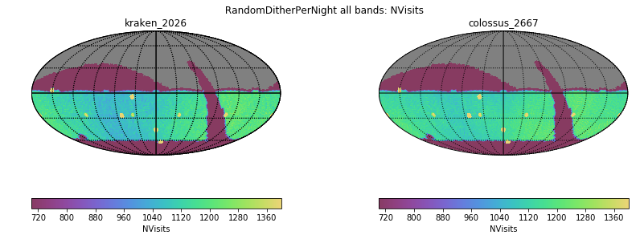
- [Nvisits alt/az all bands](figures/kraken_2026_colossus_2667_Nvisits_as_function_of_Alt_Az_all_bands_HEAL_ComboSkyMap.pdf)

- [Median airmass all bands](figures/kraken_2026_colossus_2667_Median_airmass_RandomDitherPerNight_all_bands_HEAL_ComboSkyMap.pdf)
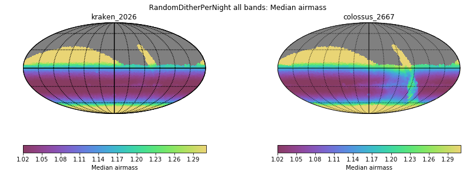
- [Max airmass all bands](figures/kraken_2026_colossus_2667_Max_airmass_RandomDitherPerNight_all_bands_HEAL_ComboSkyMap.pdf)
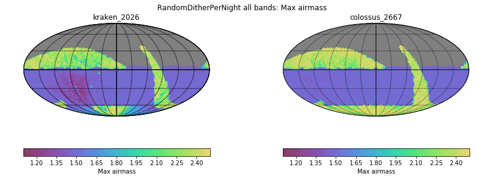
- [CoaddM5 r band](figures/kraken_2026_colossus_2667_CoaddM5_RandomDitherPerNight_r_band_HEAL_ComboSkyMap.pdf)
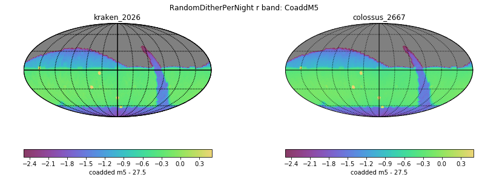
- [Normalized Proper Motion at 20.5](figures/kraken_2026_colossus_2667_Normalized_Proper_Motion_@_20_5_All_visits_RandomDitherPerNight_HEAL_ComboSkyMap.pdf)
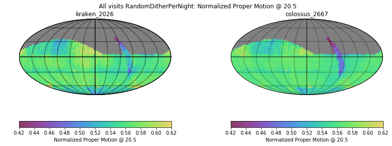
- [Normalized Parallax at 22.4](figures/kraken_2026_colossus_2667_Normalized_Parallax_@_22_4_All_visits_RandomDitherPerNight_HEAL_ComboSkyMap.pdf)
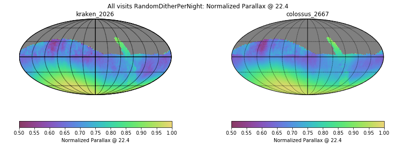
# Histrogram comparisons
### CoaddM5 r band HealPix Histrogram
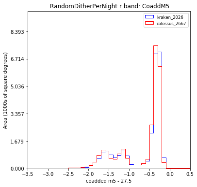
### Slew Distance Histogram
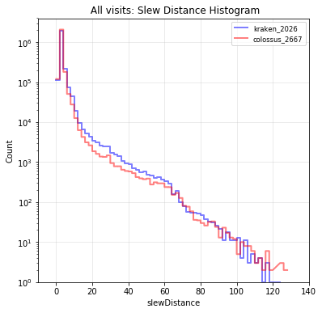
### Zoom Slew Distance Histogram
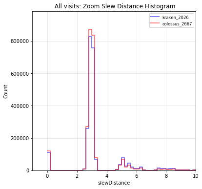
### Slew Time Histogram
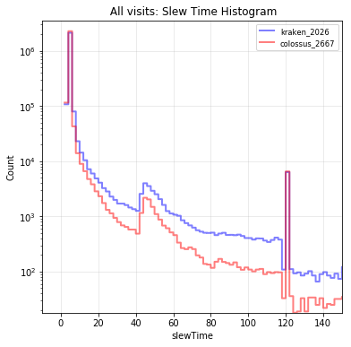
### Zoom Slew Time Histogram 
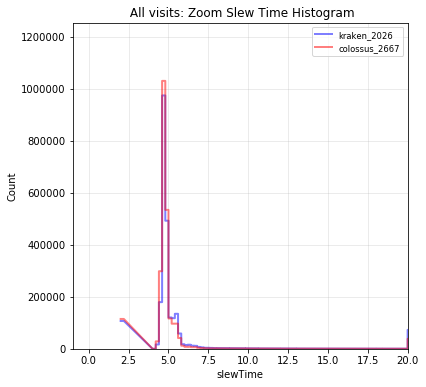
