# Table of Contents
1. [fO](#fo)
2. [Total Effective Time](#total-effective-time)
3. [Normalized Effective Time](#normalized-effective-time)
4. [Open Shutter Fraction](#open-shutter-fraction)
5. [Parallax](#parallax)
6. [Proper Motion](#proper-motion)
7. [Rapid Revisit](#rapid-revisit)
8. [Fraction in Pairs](#fraction-in-paris)
9. [Slews](#slews)
10. [Filter Changes](#filter-changes)
11. [Nvisits](#nvisits)
12. [Proposal Fractions](#proposal-fractions)
13. [Median Nvisits WFD](#median-nvisits-wfd)
14. [Median CoaddM5 WFD](#median-coaddm5-wfd)
15. [Median FiveSigmaDepth](#median-fivesigmadepth)
16. [Median Internight Gap](#median-internight-gap)
17. [Median Airmass WFD](#median-airmass-wfd)
18. [Median Seeing WFD](#median-seeing-wfd)
19. [Skymap comparisons](#skymap-comparisons)
20. [Histogram comparisons](#histogram-comparisons)
# fO
|                                                       |   kraken_2026 |   kraken_2036 |
|:------------------------------------------------------|--------------:|--------------:|
| fOArea fO All visits HealpixSlicer                    |     18056.6   |      4716.83  |
| fOArea/benchmark fO All visits HealpixSlicer          |         1.003 |         0.262 |
| fONv MedianNvis fO All visits HealpixSlicer           |       940     |       776     |
| fONv MinNvis fO All visits HealpixSlicer              |       857     |       713     |
| fONv/benchmark MedianNvis fO All visits HealpixSlicer |         1.139 |         0.941 |
| fONv/benchmark MinNvis fO All visits HealpixSlicer    |         1.039 |         0.864 |
| fOArea fO WFD HealpixSlicer                           |     18040.6   |      4441.54  |
| fOArea/benchmark fO WFD HealpixSlicer                 |         1.002 |         0.247 |
| fONv MedianNvis fO WFD HealpixSlicer                  |       938     |       774     |
| fONv MinNvis fO WFD HealpixSlicer                     |       857     |       711     |
| fONv/benchmark MedianNvis fO WFD HealpixSlicer        |         1.137 |         0.938 |
| fONv/benchmark MinNvis fO WFD HealpixSlicer           |         1.039 |         0.862 |

# Total Effective Time
|                          |   kraken_2026 |   kraken_2036 |
|:-------------------------|--------------:|--------------:|
| Total Teff all bands     |   4.08386e+07 |   3.28715e+07 |
| Total Teff WFD all bands |   3.68931e+07 |   2.97015e+07 |

# Normalized Effective Time
|                                                    |   kraken_2026 |   kraken_2036 |
|:---------------------------------------------------|--------------:|--------------:|
| Median Normalized Teff WFD all bands HealpixSlicer |         0.584 |         0.563 |
| Normalized Teff WFD all bands HealpixSlicer        |     21495     |     21495     |
| Normalized Teff WFD all bands                      |         0.584 |         0.564 |

# Open Shutter Fraction
|                                                 |   kraken_2026 |   kraken_2036 |
|:------------------------------------------------|--------------:|--------------:|
| OpenShutterFraction All visits                  |         0.735 |         0.644 |
| Median OpenShutterFraction Per night OneDSlicer |         0.739 |         0.685 |
| OpenShutterFraction Per night OneDSlicer        |      3025     |      3025     |

# Parallax
|                                                                |   kraken_2026 |   kraken_2036 |
|:---------------------------------------------------------------|--------------:|--------------:|
| Median Parallax Error @ 22.4 All visits HealpixSlicer          |         1.816 |         1.989 |
| Median Parallax Error @ 24.0 All visits HealpixSlicer          |         7.066 |         7.753 |
| Median Parallax Coverage @ 22.4 All visits HealpixSlicer       |         0.555 |         0.571 |
| Median Parallax Coverage @ 24.0 All visits HealpixSlicer       |         0.551 |         0.563 |
| Median Parallax-DCR degeneracy @ 22.4 All visits HealpixSlicer |         0.237 |         0.342 |
| Median Parallax-DCR degeneracy @ 24.0 All visits HealpixSlicer |         0.235 |         0.333 |
| Median Parallax Error @ 22.4 WFD HealpixSlicer                 |         1.606 |         1.768 |
| Median Parallax Error @ 24.0 WFD HealpixSlicer                 |         6.175 |         6.827 |
| Median Parallax Coverage @ 22.4 WFD HealpixSlicer              |         0.559 |         0.585 |
| Median Parallax Coverage @ 24.0 WFD HealpixSlicer              |         0.555 |         0.577 |
| Median Parallax-DCR degeneracy @ 22.4 WFD HealpixSlicer        |         0.175 |         0.306 |
| Median Parallax-DCR degeneracy @ 24.0 WFD HealpixSlicer        |         0.172 |         0.299 |

# Proper Motion
|                                                            |   kraken_2026 |   kraken_2036 |
|:-----------------------------------------------------------|--------------:|--------------:|
| Median Proper Motion Error @ 20.5 All visits HealpixSlicer |         0.17  |         0.177 |
| Median Proper Motion Error @ 24.0 All visits HealpixSlicer |         1.813 |         1.926 |
| Median Proper Motion Error @ 20.5 WFD HealpixSlicer        |         0.166 |         0.165 |
| Median Proper Motion Error @ 24.0 WFD HealpixSlicer        |         1.677 |         1.738 |

# Rapid Revisit
|                                                      |   kraken_2026 |   kraken_2036 |
|:-----------------------------------------------------|--------------:|--------------:|
| Area (sq deg) RapidRevisits All visits HealpixSlicer |       10178   |       23978.1 |
| Median RapidRevisits All visits HealpixSlicer        |           0   |           1   |
| RapidRevisits All visits HealpixSlicer               |       31116   |       31116   |
| Area (sq deg) RapidRevisits WFD HealpixSlicer        |       10757.1 |       31186.8 |
| Median RapidRevisits WFD HealpixSlicer               |           0   |           1   |
| RapidRevisits WFD HealpixSlicer                      |       21495   |       21495   |

# Fraction in Pairs
|                                                                          |   kraken_2026 |   kraken_2036 |
|:-------------------------------------------------------------------------|--------------:|--------------:|
| Median Fraction of visits in pairs (15-60 min) gri HealpixSlicer         |         0.868 |         0.893 |
| Median Fraction of visits in pairs (15-60 min) gri WFD+NES HealpixSlicer |         0.876 |         0.9   |

# Slews
|                            |   kraken_2026 |   kraken_2036 |
|:---------------------------|--------------:|--------------:|
| Mean slewTime All visits   |         6.789 |        12.606 |
| Median slewTime All visits |         4.792 |         4.8   |
| Min slewTime All visits    |         2     |         2     |
| Max slewTime All visits    |       156     |       156     |

# Filter Changes
|                                                |   kraken_2026 |   kraken_2036 |
|:-----------------------------------------------|--------------:|--------------:|
| Filter Changes Whole Survey                    |     10813     |     18232     |
| Filter Changes Per Night OneDSlicer            |      3025     |      3025     |
| Max Filter Changes Per Night OneDSlicer        |        24     |        41     |
| Mean Filter Changes Per Night OneDSlicer       |         3.177 |         5.515 |
| Median Filter Changes Per Night OneDSlicer     |         2     |         4     |
| Min Filter Changes Per Night OneDSlicer        |         0     |         0     |
| N(+3Sigma) Filter Changes Per Night OneDSlicer |        68     |        48     |
| N(-3Sigma) Filter Changes Per Night OneDSlicer |         0     |         0     |
| Rms Filter Changes Per Night OneDSlicer        |         3.578 |         4.705 |

# Nvisits
|                                     |    kraken_2026 |    kraken_2036 |
|:------------------------------------|---------------:|---------------:|
| Fraction of total Nvisits All props |    1           |    1           |
| Nvisits All props                   |    2.43839e+06 |    2.06791e+06 |
| Median Nvisits All props OneDSlicer |  806           |  686           |
| Nvisits All props OneDSlicer        | 3025           | 3025           |

# Proposal Fractions
|                                                  |   kraken_2026 |   kraken_2036 |
|:-------------------------------------------------|--------------:|--------------:|
| Fraction of total Nvisits All props              |         1     |         1     |
| Fraction of total Nvisits SouthCelestialPole     |         0.02  |         0.025 |
| Fraction of total Nvisits NorthEclipticSpur      |         0.054 |         0.062 |
| Fraction of total Nvisits GalacticPlane          |         0.016 |         0.02  |
| Fraction of total Nvisits WFD                    |         0.864 |         0.848 |
| Fraction of total Nvisits DeepDrillingCosmology1 |         0.046 |         0.045 |
| Fraction of total Nvisits DD                     |         0.046 |         0.045 |

# Median Nvisits WFD
|                                            |   kraken_2026 |   kraken_2036 |
|:-------------------------------------------|--------------:|--------------:|
| Median NVisits WFD i band HealpixSlicer    |           204 |           164 |
| Median NVisits WFD g band HealpixSlicer    |            90 |            71 |
| Median NVisits WFD y band HealpixSlicer    |           188 |           160 |
| Median NVisits WFD u band HealpixSlicer    |            64 |            51 |
| Median NVisits WFD r band HealpixSlicer    |           206 |           166 |
| Median NVisits WFD z band HealpixSlicer    |           186 |           160 |
| Median NVisits WFD all bands HealpixSlicer |           938 |           774 |

# Median CoaddM5 WFD
|                                         |   kraken_2026 |   kraken_2036 |
|:----------------------------------------|--------------:|--------------:|
| Median CoaddM5 WFD i band HealpixSlicer |        26.618 |        26.495 |
| Median CoaddM5 WFD g band HealpixSlicer |        27.149 |        27.018 |
| Median CoaddM5 WFD y band HealpixSlicer |        24.906 |        24.794 |
| Median CoaddM5 WFD u band HealpixSlicer |        25.651 |        25.484 |
| Median CoaddM5 WFD r band HealpixSlicer |        27.201 |        27.076 |
| Median CoaddM5 WFD z band HealpixSlicer |        25.72  |        25.624 |

# Median FiveSigmaDepth
|                                                          |   kraken_2026 |   kraken_2036 |
|:---------------------------------------------------------|--------------:|--------------:|
| Median Median fiveSigmaDepth WFD i band HealpixSlicer    |        23.691 |        23.668 |
| Median Median fiveSigmaDepth WFD g band HealpixSlicer    |        24.646 |        24.643 |
| Median Median fiveSigmaDepth WFD y band HealpixSlicer    |        21.997 |        21.97  |
| Median Median fiveSigmaDepth WFD u band HealpixSlicer    |        23.337 |        23.286 |
| Median Median fiveSigmaDepth WFD r band HealpixSlicer    |        24.263 |        24.242 |
| Median Median fiveSigmaDepth WFD z band HealpixSlicer    |        22.783 |        22.741 |
| Median Median fiveSigmaDepth WFD all bands HealpixSlicer |        23.492 |        23.417 |

# Median Internight Gap
|                                                           |   kraken_2026 |   kraken_2036 |
|:----------------------------------------------------------|--------------:|--------------:|
| Median Median Inter-Night Gap WFD i band HealpixSlicer    |        10.957 |         5.967 |
| Median Median Inter-Night Gap WFD g band HealpixSlicer    |        25.858 |        16.928 |
| Median Median Inter-Night Gap WFD y band HealpixSlicer    |         3.962 |         2.001 |
| Median Median Inter-Night Gap WFD u band HealpixSlicer    |        23.959 |         3.015 |
| Median Median Inter-Night Gap WFD r band HealpixSlicer    |         7.941 |         3.971 |
| Median Median Inter-Night Gap WFD z band HealpixSlicer    |         5.994 |         2.96  |
| Median Median Inter-Night Gap WFD all bands HealpixSlicer |         1.956 |         1.015 |

# Median Airmass WFD
|                                                   |   kraken_2026 |   kraken_2036 |
|:--------------------------------------------------|--------------:|--------------:|
| Median Median airmass WFD i band HealpixSlicer    |         1.044 |         1.053 |
| Median Median airmass WFD g band HealpixSlicer    |         1.044 |         1.052 |
| Median Median airmass WFD y band HealpixSlicer    |         1.079 |         1.086 |
| Median Median airmass WFD u band HealpixSlicer    |         1.044 |         1.064 |
| Median Median airmass WFD r band HealpixSlicer    |         1.043 |         1.05  |
| Median Median airmass WFD z band HealpixSlicer    |         1.05  |         1.085 |
| Median Median airmass WFD all bands HealpixSlicer |         1.045 |         1.058 |

# Median Seeing WFD
|                                                     |   kraken_2026 |   kraken_2036 |
|:----------------------------------------------------|--------------:|--------------:|
| Median Median seeingEff WFD i band HealpixSlicer    |         0.827 |         0.835 |
| Median Median seeingEff WFD g band HealpixSlicer    |         0.891 |         0.893 |
| Median Median seeingEff WFD y band HealpixSlicer    |         0.805 |         0.819 |
| Median Median seeingEff WFD u band HealpixSlicer    |         0.945 |         0.968 |
| Median Median seeingEff WFD r band HealpixSlicer    |         0.854 |         0.859 |
| Median Median seeingEff WFD z band HealpixSlicer    |         0.811 |         0.837 |
| Median Median seeingEff WFD all bands HealpixSlicer |         0.836 |         0.848 |

# Skymap comparisons
- [Nvisits all bands](figures/kraken_2026_kraken_2036_NVisits_all_bands_HEAL_ComboSkyMap.pdf)
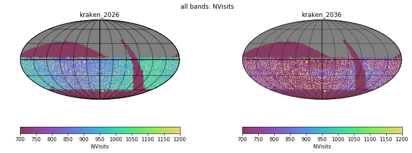
- [Nvisits alt/az all bands](figures/kraken_2026_kraken_2036_Nvisits_as_function_of_Alt_Az_all_bands_HEAL_ComboSkyMap.pdf)
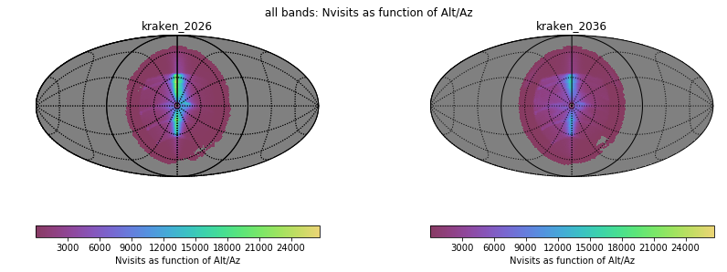
- [Median airmass all bands](figures/kraken_2026_kraken_2036_Median_airmass_all_bands_HEAL_ComboSkyMap.pdf)
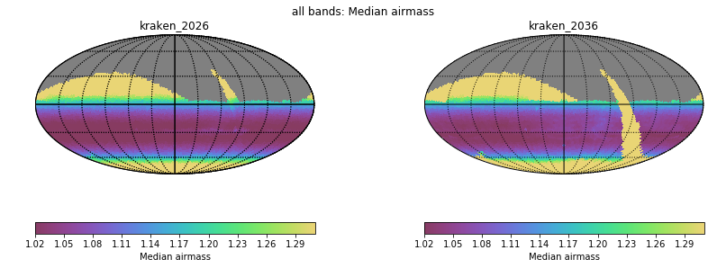
- [Max airmass all bands](figures/kraken_2026_kraken_2036_Max_airmass_all_bands_HEAL_ComboSkyMap.pdf)
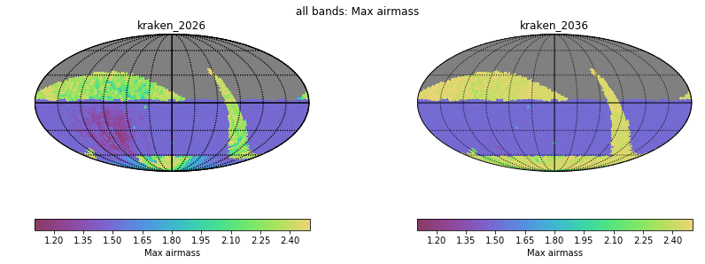
- [CoaddM5 r band](figures/kraken_2026_kraken_2036_CoaddM5_r_band_HEAL_ComboSkyMap.pdf)
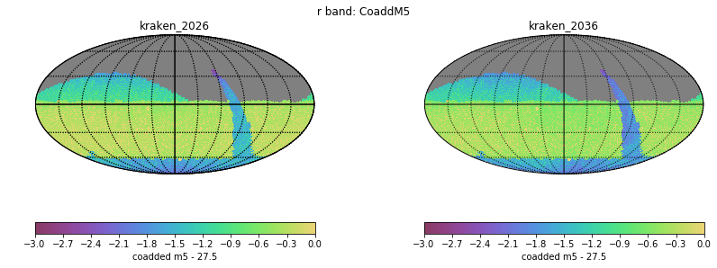
- [Normalized Proper Motion at 20.5](figures/kraken_2026_kraken_2036_Normalized_Proper_Motion_@_20_5_All_visits_HEAL_ComboSkyMap.pdf)
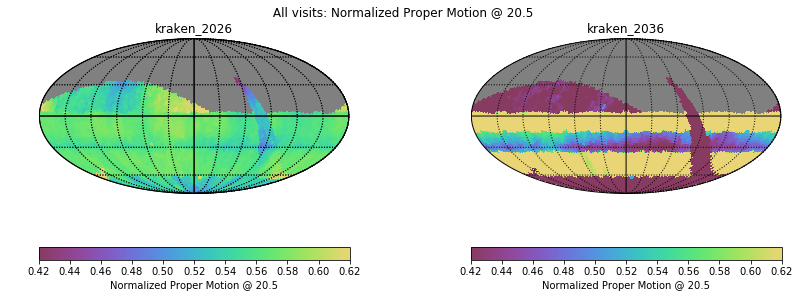
- [Normalized Parallax at 22.4](figures/kraken_2026_kraken_2036_Normalized_Parallax_@_22_4_All_visits_HEAL_ComboSkyMap.pdf)
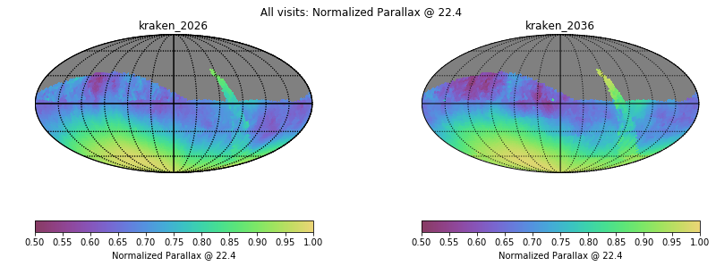
# Histogram comparisons
### CoaddM5 r band HealPix Histogram
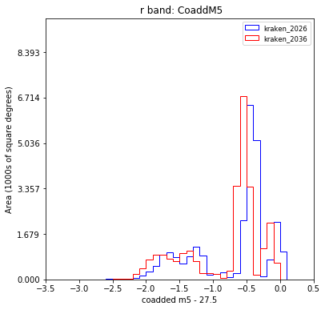
### Slew Distance Histogram
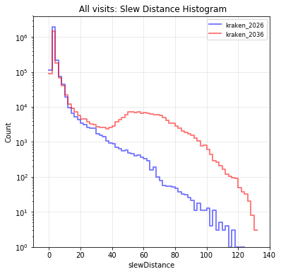
### Zoom Slew Distance Histogram
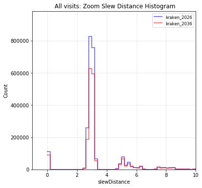
### Slew Time Histogram
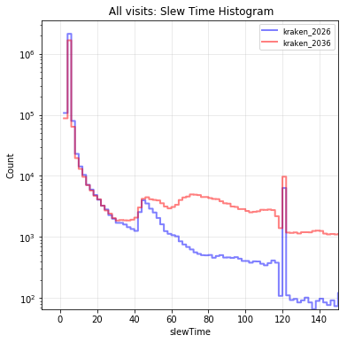
### Zoom Slew Time Histogram
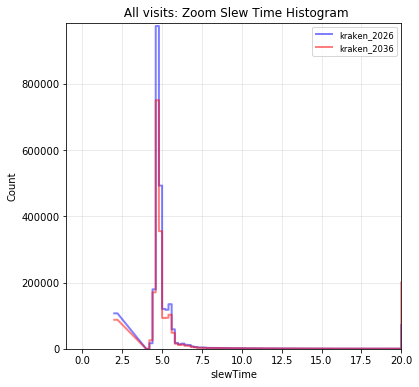
