# Table of Contents
1. [fO](#fo)
2. [Total Effective Time](#total-effective-time)
3. [Normalized Effective Time](#normalized-effective-time)
4. [Open Shutter Fraction](#open-shutter-fraction)
5. [Parallax](#parallax)
6. [Proper Motion](#proper-motion)
7. [Rapid Revisit](#rapid-revisit)
8. [Fraction in Pairs](#fraction-in-pairs)
9. [Slews](#slews)
10. [Filter Changes](#filter-changes)
11. [Nvisits](#nvisits)
12. [Proposal Fractions](#proposal-fractions)
13. [Median Nvisits WFD](#median-nvisits-wfd)
14. [Median CoaddM5 WFD](#median-coaddm5-wfd)
15. [Median Airmass WFD](#median-airmass-wfd)
16. [Median Seeing WFD](#median-seeing-wfd)
17. [Skymap comparisons](#skymap-comparisons)
18. [Histrogram comparisons](#histrogram-comparisons)
# fO
|                                                       |   kraken_2026 |   mothra_2045 |
|:------------------------------------------------------|--------------:|--------------:|
| fOArea: Nvisits (#) fO All visits HealpixSlicer       |       857     |       475     |
| fOArea: Nvisits/benchmark fO All visits HealpixSlicer |         1.039 |         0.576 |
| fONv: Area (sqdeg) fO All visits HealpixSlicer        |     18056.6   |      4945.96  |
| fONv: Area/benchmark fO All visits HealpixSlicer      |         1.003 |         0.275 |
| fOArea: Nvisits (#) fO WFD HealpixSlicer              |       857     |       466     |
| fOArea: Nvisits/benchmark fO WFD HealpixSlicer        |         1.039 |         0.565 |
| fONv: Area (sqdeg) fO WFD HealpixSlicer               |     18040.6   |      4789.85  |
| fONv: Area/benchmark fO WFD HealpixSlicer             |         1.002 |         0.266 |

# Total Effective Time
|                          |   kraken_2026 |   mothra_2045 |
|:-------------------------|--------------:|--------------:|
| Total Teff all bands     |   4.08386e+07 |   2.93657e+07 |
| Total Teff WFD all bands |   3.68931e+07 |   2.62976e+07 |

# Normalized Effective Time
|                                                    |   kraken_2026 |   mothra_2045 |
|:---------------------------------------------------|--------------:|--------------:|
| Normalized Teff WFD all bands                      |         0.584 |         0.583 |
| Median Normalized Teff WFD all bands HealpixSlicer |         0.584 |         0.513 |
| Normalized Teff WFD all bands HealpixSlicer        |     21495     |     21495     |

# Open Shutter Fraction
|                                                 |   kraken_2026 |   mothra_2045 |
|:------------------------------------------------|--------------:|--------------:|
| OpenShutterFraction All visits                  |         0.735 |         0.598 |
| Median OpenShutterFraction Per night OneDSlicer |         0.739 |         0.619 |
| OpenShutterFraction Per night OneDSlicer        |      3025     |      3022     |

# Parallax
|                                                                |   kraken_2026 |   mothra_2045 |
|:---------------------------------------------------------------|--------------:|--------------:|
| Median Parallax Error @ 22.4 All visits HealpixSlicer          |         1.816 |         2.63  |
| Median Parallax Error @ 24.0 All visits HealpixSlicer          |         7.066 |        10.527 |
| Median Parallax Coverage @ 22.4 All visits HealpixSlicer       |         0.555 |         0.501 |
| Median Parallax Coverage @ 24.0 All visits HealpixSlicer       |         0.551 |         0.494 |
| Median Parallax-DCR degeneracy @ 22.4 All visits HealpixSlicer |         0.237 |         0.329 |
| Median Parallax-DCR degeneracy @ 24.0 All visits HealpixSlicer |         0.235 |         0.328 |
| Median Parallax Error @ 22.4 WFD HealpixSlicer                 |         1.606 |         1.856 |
| Median Parallax Error @ 24.0 WFD HealpixSlicer                 |         6.175 |         7.306 |
| Median Parallax Coverage @ 22.4 WFD HealpixSlicer              |         0.559 |         0.528 |
| Median Parallax Coverage @ 24.0 WFD HealpixSlicer              |         0.555 |         0.519 |
| Median Parallax-DCR degeneracy @ 22.4 WFD HealpixSlicer        |         0.175 |         0.275 |
| Median Parallax-DCR degeneracy @ 24.0 WFD HealpixSlicer        |         0.172 |         0.272 |

# Proper Motion
|                                                            |   kraken_2026 |   mothra_2045 |
|:-----------------------------------------------------------|--------------:|--------------:|
| Median Proper Motion Error @ 20.5 All visits HealpixSlicer |         0.17  |         0.261 |
| Median Proper Motion Error @ 24.0 All visits HealpixSlicer |         1.813 |         3.049 |
| Median Proper Motion Error @ 20.5 WFD HealpixSlicer        |         0.166 |         0.195 |
| Median Proper Motion Error @ 24.0 WFD HealpixSlicer        |         1.677 |         2.143 |

# Rapid Revisit
|                                                      |   kraken_2026 |   mothra_2045 |
|:-----------------------------------------------------|--------------:|--------------:|
| Area (sq deg) RapidRevisits All visits HealpixSlicer |       10178   |       19845.6 |
| Median RapidRevisits All visits HealpixSlicer        |           0   |           0   |
| RapidRevisits All visits HealpixSlicer               |       31116   |       31116   |
| Area (sq deg) RapidRevisits WFD HealpixSlicer        |       10757.1 |       25688.3 |
| Median RapidRevisits WFD HealpixSlicer               |           0   |           1   |
| RapidRevisits WFD HealpixSlicer                      |       21495   |       21495   |

# Fraction in Pairs
|                                                                          |   kraken_2026 |   mothra_2045 |
|:-------------------------------------------------------------------------|--------------:|--------------:|
| Median Fraction of visits in pairs (15-60 min) gri WFD+NES HealpixSlicer |         0.876 |         0.885 |
| Median Fraction of visits in pairs (15-60 min) gri HealpixSlicer         |         0.868 |         0.876 |

# Slews
|                            |   kraken_2026 |   mothra_2045 |
|:---------------------------|--------------:|--------------:|
| Mean slewTime All visits   |         6.789 |        16.191 |
| Median slewTime All visits |         4.792 |         4.835 |
| Min slewTime All visits    |         2     |         2     |
| Max slewTime All visits    |       156     |       156     |

# Filter Changes
|                                                |   kraken_2026 |   mothra_2045 |
|:-----------------------------------------------|--------------:|--------------:|
| Filter Changes Whole Survey                    |     10813     |     26436     |
| Filter Changes Per Night OneDSlicer            |      3025     |      3022     |
| Max Filter Changes Per Night OneDSlicer        |        24     |        65     |
| Mean Filter Changes Per Night OneDSlicer       |         3.177 |         8.247 |
| Median Filter Changes Per Night OneDSlicer     |         2     |         7     |
| Min Filter Changes Per Night OneDSlicer        |         0     |         0     |
| N(+3Sigma) Filter Changes Per Night OneDSlicer |        68     |        54     |
| N(-3Sigma) Filter Changes Per Night OneDSlicer |         0     |         0     |
| Rms Filter Changes Per Night OneDSlicer        |         3.578 |         6.715 |

# Nvisits
|                                     |    kraken_2026 |    mothra_2045 |
|:------------------------------------|---------------:|---------------:|
| Fraction of total Nvisits All props |    1           |    1           |
| Nvisits All props                   |    2.43839e+06 |    1.79992e+06 |
| Median Nvisits All props OneDSlicer |  806           |  618           |
| Nvisits All props OneDSlicer        | 3025           | 3022           |

# Proposal Fractions
|                                                  |   kraken_2026 |   mothra_2045 |
|:-------------------------------------------------|--------------:|--------------:|
| Fraction of total Nvisits All props              |         1     |         1     |
| Fraction of total Nvisits GalacticPlane          |         0.016 |         0.023 |
| Fraction of total Nvisits WideFastDeep           |         0.864 |         0.835 |
| Fraction of total Nvisits DeepDrillingCosmology1 |         0.046 |         0.052 |
| Fraction of total Nvisits DD                     |         0.046 |         0.052 |
| Fraction of total Nvisits WFD                    |         0.864 |         0.835 |
| Fraction of total Nvisits NorthEclipticSpur      |         0.054 |         0.061 |
| Fraction of total Nvisits SouthCelestialPole     |         0.02  |         0.029 |

# Median Nvisits WFD
|                                            |   kraken_2026 |   mothra_2045 |
|:-------------------------------------------|--------------:|--------------:|
| Median NVisits WFD u band HealpixSlicer    |            64 |            47 |
| Median NVisits WFD r band HealpixSlicer    |           206 |           157 |
| Median NVisits WFD y band HealpixSlicer    |           188 |           156 |
| Median NVisits WFD g band HealpixSlicer    |            90 |            67 |
| Median NVisits WFD all bands HealpixSlicer |           938 |           715 |
| Median NVisits WFD z band HealpixSlicer    |           186 |           157 |
| Median NVisits WFD i band HealpixSlicer    |           204 |           148 |

# Median CoaddM5 WFD
|                                         |   kraken_2026 |   mothra_2045 |
|:----------------------------------------|--------------:|--------------:|
| Median CoaddM5 WFD u band HealpixSlicer |        25.651 |        25.395 |
| Median CoaddM5 WFD r band HealpixSlicer |        27.201 |        27.059 |
| Median CoaddM5 WFD y band HealpixSlicer |        24.906 |        24.777 |
| Median CoaddM5 WFD g band HealpixSlicer |        27.149 |        26.95  |
| Median CoaddM5 WFD z band HealpixSlicer |        25.72  |        25.668 |
| Median CoaddM5 WFD i band HealpixSlicer |        26.618 |        26.452 |

# Median Airmass WFD
|                                                   |   kraken_2026 |   mothra_2045 |
|:--------------------------------------------------|--------------:|--------------:|
| Median Median airmass WFD u band HealpixSlicer    |         1.044 |         1.08  |
| Median Median airmass WFD r band HealpixSlicer    |         1.043 |         1.053 |
| Median Median airmass WFD y band HealpixSlicer    |         1.079 |         1.133 |
| Median Median airmass WFD g band HealpixSlicer    |         1.044 |         1.065 |
| Median Median airmass WFD all bands HealpixSlicer |         1.045 |         1.088 |
| Median Median airmass WFD z band HealpixSlicer    |         1.05  |         1.132 |
| Median Median airmass WFD i band HealpixSlicer    |         1.044 |         1.071 |

# Median Seeing WFD
|                                                     |   kraken_2026 |   mothra_2045 |
|:----------------------------------------------------|--------------:|--------------:|
| Median Median seeingEff WFD u band HealpixSlicer    |         0.945 |         0.989 |
| Median Median seeingEff WFD r band HealpixSlicer    |         0.854 |         0.86  |
| Median Median seeingEff WFD y band HealpixSlicer    |         0.805 |         0.846 |
| Median Median seeingEff WFD g band HealpixSlicer    |         0.891 |         0.909 |
| Median Median seeingEff WFD all bands HealpixSlicer |         0.836 |         0.869 |
| Median Median seeingEff WFD z band HealpixSlicer    |         0.811 |         0.86  |
| Median Median seeingEff WFD i band HealpixSlicer    |         0.827 |         0.836 |

# Skymap comparisons
- [Nvisits all bands](figures/mothra_2045_kraken_2026_NVisits_all_bands_HEAL_ComboSkyMap.pdf)
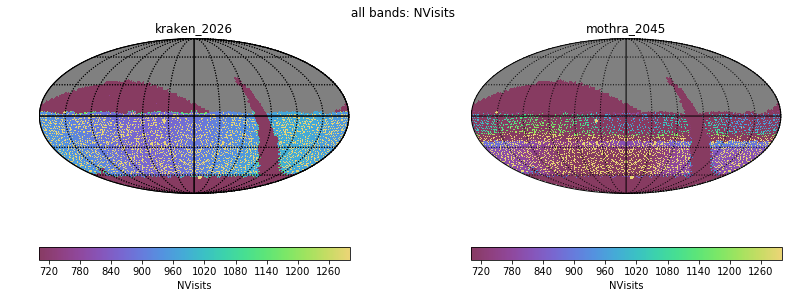
- [Nvisits alt/az all bands](figures/mothra_2045_kraken_2026_Nvisits_as_function_of_Alt_Az_all_bands_HEAL_ComboSkyMap.pdf)
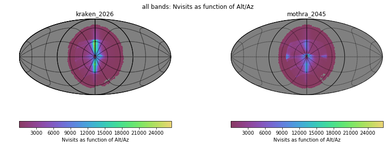
- [Median airmass all bands](figures/mothra_2045_kraken_2026_Median_airmass_all_bands_HEAL_ComboSkyMap.pdf)
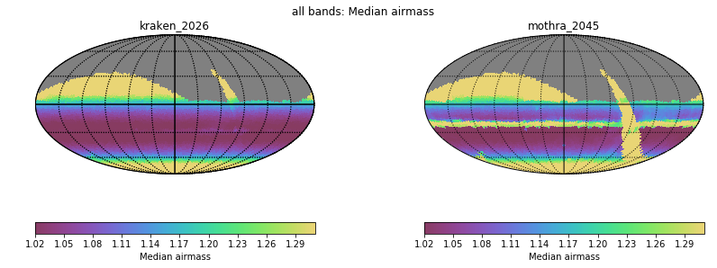
- [Max airmass all bands](figures/mothra_2045_kraken_2026_Max_airmass_all_bands_HEAL_ComboSkyMap.pdf)
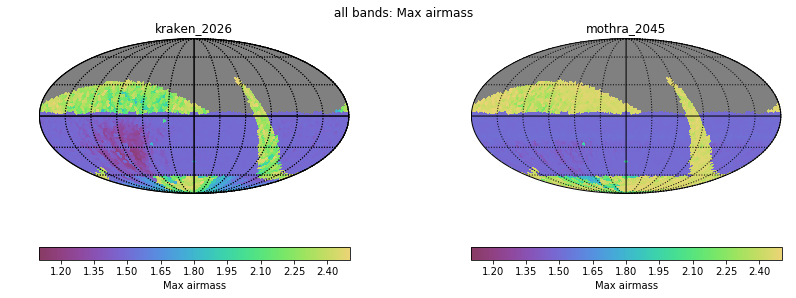
- [CoaddM5 r band](figures/mothra_2045_kraken_2026_CoaddM5_r_band_HEAL_ComboSkyMap.pdf)
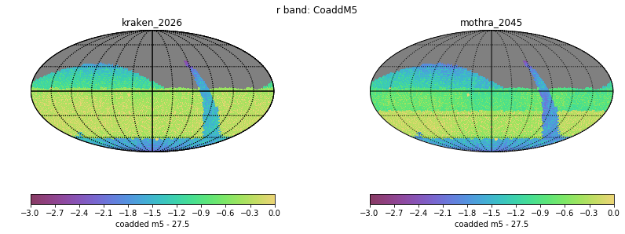
- [Normalized Proper Motion at 20.5](figures/mothra_2045_kraken_2026_Normalized_Proper_Motion_@_20_5_All_visits_HEAL_ComboSkyMap.pdf)
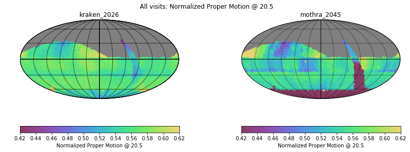
- [Normalized Parallax at 22.4](figures/mothra_2045_kraken_2026_Normalized_Parallax_@_22_4_All_visits_HEAL_ComboSkyMap.pdf)
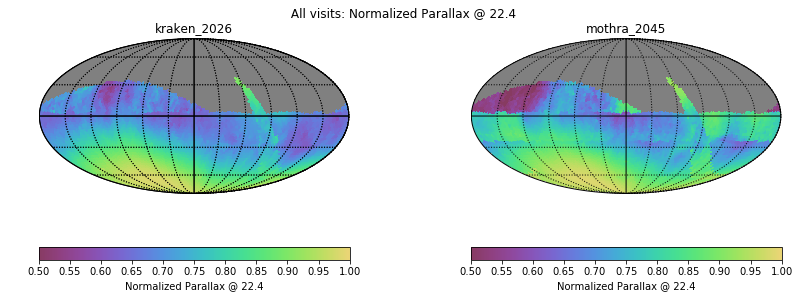
# Histrogram comparisons
### CoaddM5 r band HealPix Histrogram
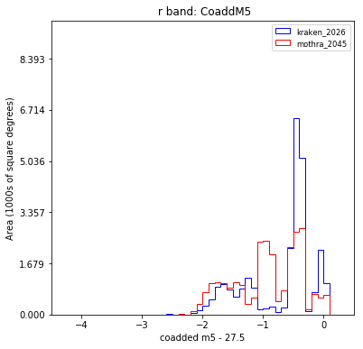
### Slew Distance Histogram
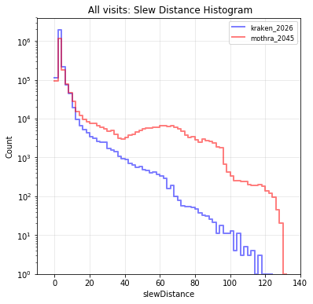
### Zoom Slew Distance Histogram
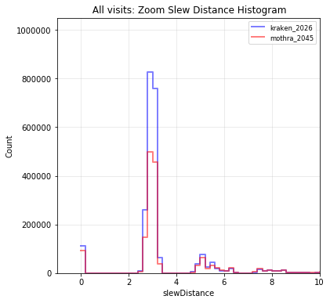
### Slew Time Histogram
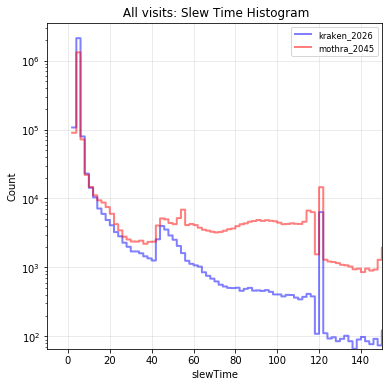
### Zoom Slew Time Histogram 
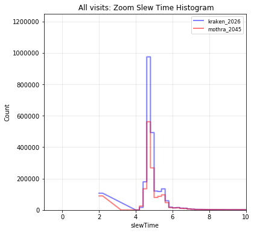
