# Table of Contents
1. [fO](#fo)
2. [Total Effective Time](#total-effective-time)
3. [Normalized Effective Time](#normalized-effective-time)
4. [Open Shutter Fraction](#open-shutter-fraction)
5. [Parallax](#parallax)
6. [Proper Motion](#proper-motion)
7. [Rapid Revisit](#rapid-revisit)
8. [Fraction in Pairs](#fraction-in-paris)
9. [Slews](#slews)
10. [Filter Changes](#filter-changes)
11. [Nvisits](#nvisits)
12. [Proposal Fractions](#proposal-fractions)
13. [Median Nvisits WFD](#median-nvisits-wfd)
14. [Median CoaddM5 WFD](#median-coaddm5-wfd)
15. [Median FiveSigmaDepth](#median-fivesigmadepth)
16. [Median Internight Gap](#median-internight-gap)
17. [Median Airmass WFD](#median-airmass-wfd)
18. [Median Seeing WFD](#median-seeing-wfd)
19. [Skymap comparisons](#skymap-comparisons)
20. [Histogram comparisons](#histogram-comparisons)
# fO
|                                                       |   kraken_2026 |   nexus_2097 |
|:------------------------------------------------------|--------------:|-------------:|
| fOArea fO All visits HealpixSlicer                    |     18056.6   |     6061.38  |
| fOArea/benchmark fO All visits HealpixSlicer          |         1.003 |        0.337 |
| fONv MedianNvis fO All visits HealpixSlicer           |       940     |      721     |
| fONv MinNvis fO All visits HealpixSlicer              |       857     |      692     |
| fONv/benchmark MedianNvis fO All visits HealpixSlicer |         1.139 |        0.874 |
| fONv/benchmark MinNvis fO All visits HealpixSlicer    |         1.039 |        0.839 |
| fOArea fO WFD HealpixSlicer                           |     18040.6   |     6028.65  |
| fOArea/benchmark fO WFD HealpixSlicer                 |         1.002 |        0.335 |
| fONv MedianNvis fO WFD HealpixSlicer                  |       938     |      721     |
| fONv MinNvis fO WFD HealpixSlicer                     |       857     |      692     |
| fONv/benchmark MedianNvis fO WFD HealpixSlicer        |         1.137 |        0.874 |
| fONv/benchmark MinNvis fO WFD HealpixSlicer           |         1.039 |        0.839 |

# Total Effective Time
|                          |   kraken_2026 |   nexus_2097 |
|:-------------------------|--------------:|-------------:|
| Total Teff all bands     |   4.08386e+07 |  3.89278e+07 |
| Total Teff WFD all bands |   3.68931e+07 |  3.75834e+07 |

# Normalized Effective Time
|                                                    |   kraken_2026 |   nexus_2097 |
|:---------------------------------------------------|--------------:|-------------:|
| Median Normalized Teff WFD all bands HealpixSlicer |         0.584 |        0.552 |
| Normalized Teff WFD all bands HealpixSlicer        |     21495     |    31568     |
| Normalized Teff WFD all bands                      |         0.584 |        0.531 |

# Open Shutter Fraction
|                                                 |   kraken_2026 |   nexus_2097 |
|:------------------------------------------------|--------------:|-------------:|
| OpenShutterFraction All visits                  |         0.735 |        0.738 |
| Median OpenShutterFraction Per night OneDSlicer |         0.739 |        0.742 |
| OpenShutterFraction Per night OneDSlicer        |      3025     |     3025     |

# Parallax
|                                                                |   kraken_2026 |   nexus_2097 |
|:---------------------------------------------------------------|--------------:|-------------:|
| Median Parallax Error @ 22.4 All visits HealpixSlicer          |         1.816 |        2.019 |
| Median Parallax Error @ 24.0 All visits HealpixSlicer          |         7.066 |        7.934 |
| Median Parallax Coverage @ 22.4 All visits HealpixSlicer       |         0.555 |        0.574 |
| Median Parallax Coverage @ 24.0 All visits HealpixSlicer       |         0.551 |        0.57  |
| Median Parallax-DCR degeneracy @ 22.4 All visits HealpixSlicer |         0.237 |        0.308 |
| Median Parallax-DCR degeneracy @ 24.0 All visits HealpixSlicer |         0.235 |        0.306 |
| Median Parallax Error @ 22.4 WFD HealpixSlicer                 |         1.606 |        2.019 |
| Median Parallax Error @ 24.0 WFD HealpixSlicer                 |         6.175 |        7.937 |
| Median Parallax Coverage @ 22.4 WFD HealpixSlicer              |         0.559 |        0.574 |
| Median Parallax Coverage @ 24.0 WFD HealpixSlicer              |         0.555 |        0.57  |
| Median Parallax-DCR degeneracy @ 22.4 WFD HealpixSlicer        |         0.175 |        0.308 |
| Median Parallax-DCR degeneracy @ 24.0 WFD HealpixSlicer        |         0.172 |        0.306 |

# Proper Motion
|                                                            |   kraken_2026 |   nexus_2097 |
|:-----------------------------------------------------------|--------------:|-------------:|
| Median Proper Motion Error @ 20.5 All visits HealpixSlicer |         0.17  |        0.2   |
| Median Proper Motion Error @ 24.0 All visits HealpixSlicer |         1.813 |        2.137 |
| Median Proper Motion Error @ 20.5 WFD HealpixSlicer        |         0.166 |        0.2   |
| Median Proper Motion Error @ 24.0 WFD HealpixSlicer        |         1.677 |        2.137 |

# Rapid Revisit
|                                                      |   kraken_2026 |   nexus_2097 |
|:-----------------------------------------------------|--------------:|-------------:|
| Area (sq deg) RapidRevisits All visits HealpixSlicer |       10178   |      20120.8 |
| Median RapidRevisits All visits HealpixSlicer        |           0   |          0   |
| RapidRevisits All visits HealpixSlicer               |       31116   |      31568   |
| Area (sq deg) RapidRevisits WFD HealpixSlicer        |       10757.1 |      20092   |
| Median RapidRevisits WFD HealpixSlicer               |           0   |          0   |
| RapidRevisits WFD HealpixSlicer                      |       21495   |      31568   |

# Fraction in Pairs
|                                                                          |   kraken_2026 |   nexus_2097 |
|:-------------------------------------------------------------------------|--------------:|-------------:|
| Median Fraction of visits in pairs (15-60 min) gri HealpixSlicer         |         0.868 |        0.935 |
| Median Fraction of visits in pairs (15-60 min) gri WFD+NES HealpixSlicer |         0.876 |        0.935 |

# Slews
|                            |   kraken_2026 |   nexus_2097 |
|:---------------------------|--------------:|-------------:|
| Mean slewTime All visits   |         6.789 |        6.659 |
| Median slewTime All visits |         4.792 |        4.778 |
| Min slewTime All visits    |         2     |        2     |
| Max slewTime All visits    |       156     |      156     |

# Filter Changes
|                                                |   kraken_2026 |   nexus_2097 |
|:-----------------------------------------------|--------------:|-------------:|
| Filter Changes Whole Survey                    |     10813     |    10803     |
| Filter Changes Per Night OneDSlicer            |      3025     |     3025     |
| Max Filter Changes Per Night OneDSlicer        |        24     |       23     |
| Mean Filter Changes Per Night OneDSlicer       |         3.177 |        3.177 |
| Median Filter Changes Per Night OneDSlicer     |         2     |        2     |
| Min Filter Changes Per Night OneDSlicer        |         0     |        0     |
| N(+3Sigma) Filter Changes Per Night OneDSlicer |        68     |       63     |
| N(-3Sigma) Filter Changes Per Night OneDSlicer |         0     |        0     |
| Rms Filter Changes Per Night OneDSlicer        |         3.578 |        3.48  |

# Nvisits
|                                     |    kraken_2026 |     nexus_2097 |
|:------------------------------------|---------------:|---------------:|
| Fraction of total Nvisits All props |    1           |    1           |
| Nvisits All props                   |    2.43839e+06 |    2.44179e+06 |
| Median Nvisits All props OneDSlicer |  806           |  807           |
| Nvisits All props OneDSlicer        | 3025           | 3025           |

# Proposal Fractions
|                                                  |   kraken_2026 |   nexus_2097 |
|:-------------------------------------------------|--------------:|-------------:|
| Fraction of total Nvisits All props              |         1     |        1     |
| Fraction of total Nvisits WFD                    |         0.864 |        0.966 |
| Fraction of total Nvisits DeepDrillingCosmology1 |         0.046 |        0.034 |
| Fraction of total Nvisits DD                     |         0.046 |        0.034 |
| Fraction of total Nvisits WideFastDeep           |         0.864 |        0.966 |

# Median Nvisits WFD
|                                            |   kraken_2026 |   nexus_2097 |
|:-------------------------------------------|--------------:|-------------:|
| Median NVisits WFD i band HealpixSlicer    |           204 |          149 |
| Median NVisits WFD g band HealpixSlicer    |            90 |           64 |
| Median NVisits WFD y band HealpixSlicer    |           188 |          147 |
| Median NVisits WFD u band HealpixSlicer    |            64 |           46 |
| Median NVisits WFD r band HealpixSlicer    |           206 |          149 |
| Median NVisits WFD z band HealpixSlicer    |           186 |          155 |
| Median NVisits WFD all bands HealpixSlicer |           938 |          705 |

# Median CoaddM5 WFD
|                                         |   kraken_2026 |   nexus_2097 |
|:----------------------------------------|--------------:|-------------:|
| Median CoaddM5 WFD i band HealpixSlicer |        26.618 |       26.437 |
| Median CoaddM5 WFD g band HealpixSlicer |        27.149 |       26.912 |
| Median CoaddM5 WFD y band HealpixSlicer |        24.906 |       24.728 |
| Median CoaddM5 WFD u band HealpixSlicer |        25.651 |       25.408 |
| Median CoaddM5 WFD r band HealpixSlicer |        27.201 |       26.997 |
| Median CoaddM5 WFD z band HealpixSlicer |        25.72  |       25.585 |

# Median FiveSigmaDepth
|                                                          |   kraken_2026 |   nexus_2097 |
|:---------------------------------------------------------|--------------:|-------------:|
| Median Median fiveSigmaDepth WFD i band HealpixSlicer    |        23.691 |       23.665 |
| Median Median fiveSigmaDepth WFD g band HealpixSlicer    |        24.646 |       24.596 |
| Median Median fiveSigmaDepth WFD y band HealpixSlicer    |        21.997 |       21.96  |
| Median Median fiveSigmaDepth WFD u band HealpixSlicer    |        23.337 |       23.241 |
| Median Median fiveSigmaDepth WFD r band HealpixSlicer    |        24.263 |       24.232 |
| Median Median fiveSigmaDepth WFD z band HealpixSlicer    |        22.783 |       22.747 |
| Median Median fiveSigmaDepth WFD all bands HealpixSlicer |        23.492 |       23.386 |

# Median Internight Gap
|                                                           |   kraken_2026 |   nexus_2097 |
|:----------------------------------------------------------|--------------:|-------------:|
| Median Median Inter-Night Gap WFD i band HealpixSlicer    |        10.957 |        6.454 |
| Median Median Inter-Night Gap WFD g band HealpixSlicer    |        25.858 |       16.952 |
| Median Median Inter-Night Gap WFD y band HealpixSlicer    |         3.962 |        2.021 |
| Median Median Inter-Night Gap WFD u band HealpixSlicer    |        23.959 |        2.978 |
| Median Median Inter-Night Gap WFD r band HealpixSlicer    |         7.941 |        3.971 |
| Median Median Inter-Night Gap WFD z band HealpixSlicer    |         5.994 |        1.984 |
| Median Median Inter-Night Gap WFD all bands HealpixSlicer |         1.956 |        1.014 |

# Median Airmass WFD
|                                                   |   kraken_2026 |   nexus_2097 |
|:--------------------------------------------------|--------------:|-------------:|
| Median Median airmass WFD i band HealpixSlicer    |         1.044 |        1.083 |
| Median Median airmass WFD g band HealpixSlicer    |         1.044 |        1.083 |
| Median Median airmass WFD y band HealpixSlicer    |         1.079 |        1.105 |
| Median Median airmass WFD u band HealpixSlicer    |         1.044 |        1.098 |
| Median Median airmass WFD r band HealpixSlicer    |         1.043 |        1.081 |
| Median Median airmass WFD z band HealpixSlicer    |         1.05  |        1.094 |
| Median Median airmass WFD all bands HealpixSlicer |         1.045 |        1.085 |

# Median Seeing WFD
|                                                     |   kraken_2026 |   nexus_2097 |
|:----------------------------------------------------|--------------:|-------------:|
| Median Median seeingEff WFD i band HealpixSlicer    |         0.827 |        0.837 |
| Median Median seeingEff WFD g band HealpixSlicer    |         0.891 |        0.924 |
| Median Median seeingEff WFD y band HealpixSlicer    |         0.805 |        0.822 |
| Median Median seeingEff WFD u band HealpixSlicer    |         0.945 |        0.993 |
| Median Median seeingEff WFD r band HealpixSlicer    |         0.854 |        0.872 |
| Median Median seeingEff WFD z band HealpixSlicer    |         0.811 |        0.842 |
| Median Median seeingEff WFD all bands HealpixSlicer |         0.836 |        0.851 |

# Skymap comparisons
- [Nvisits all bands](figures/kraken_2026_nexus_2097_NVisits_all_bands_HEAL_ComboSkyMap.pdf)
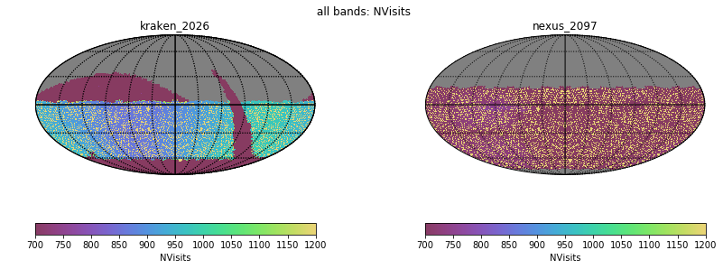
- [Nvisits alt/az all bands](figures/kraken_2026_nexus_2097_Nvisits_as_function_of_Alt_Az_all_bands_HEAL_ComboSkyMap.pdf)
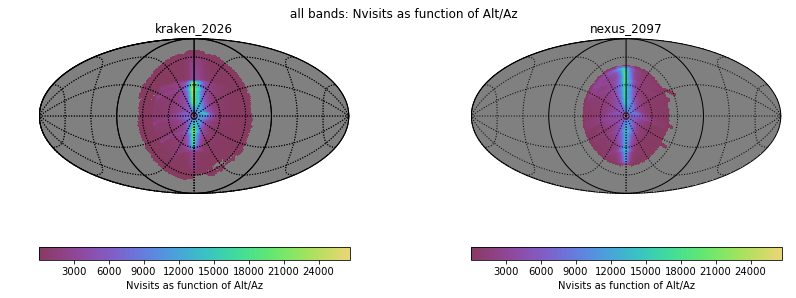
- [Median airmass all bands](figures/kraken_2026_nexus_2097_Median_airmass_all_bands_HEAL_ComboSkyMap.pdf)
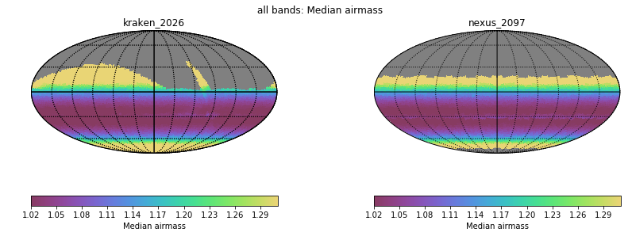
- [Max airmass all bands](figures/kraken_2026_nexus_2097_Max_airmass_all_bands_HEAL_ComboSkyMap.pdf)
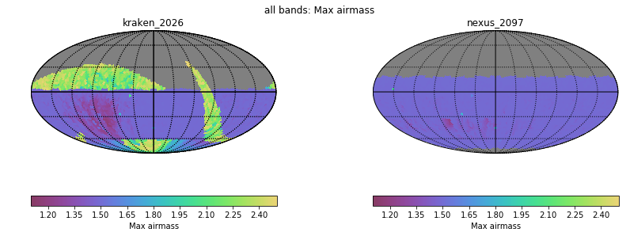
- [CoaddM5 r band](figures/kraken_2026_nexus_2097_CoaddM5_r_band_HEAL_ComboSkyMap.pdf)
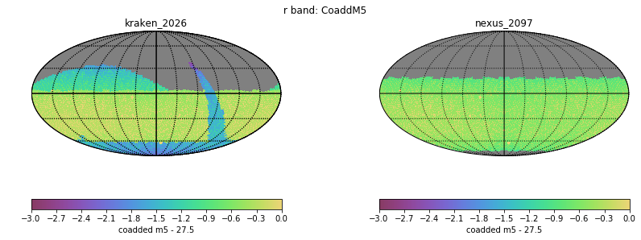
- [Normalized Proper Motion at 20.5](figures/kraken_2026_nexus_2097_Normalized_Proper_Motion_@_20_5_All_visits_HEAL_ComboSkyMap.pdf)
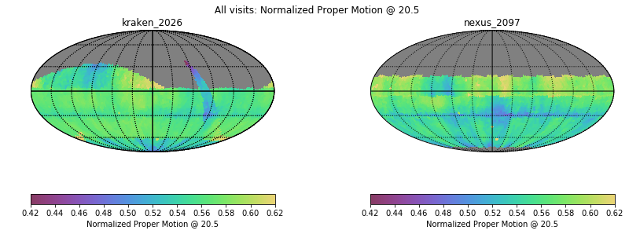
- [Normalized Parallax at 22.4](figures/kraken_2026_nexus_2097_Normalized_Parallax_@_22_4_All_visits_HEAL_ComboSkyMap.pdf)
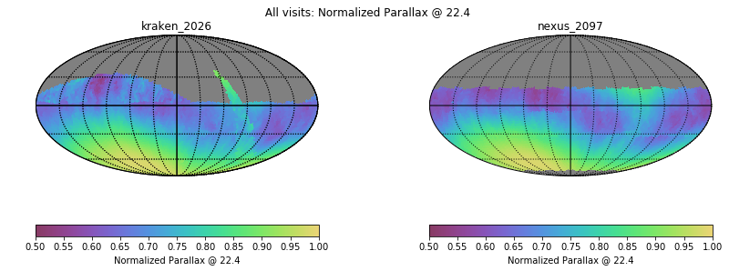
# Histogram comparisons
### CoaddM5 r band HealPix Histogram
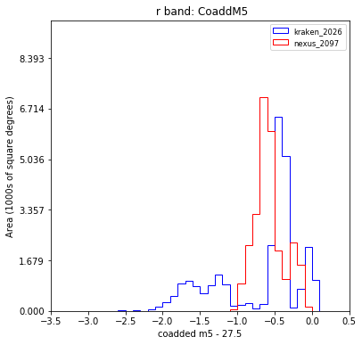
### Slew Distance Histogram
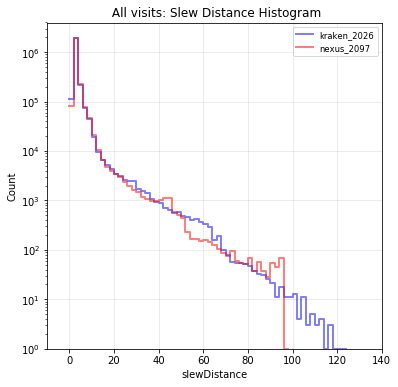
### Zoom Slew Distance Histogram
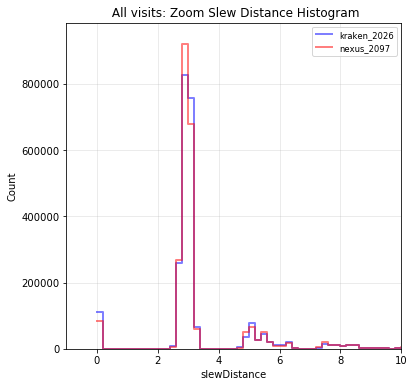
### Slew Time Histogram
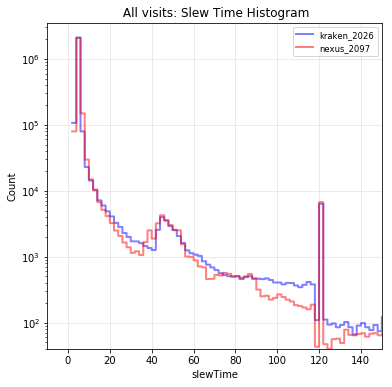
### Zoom Slew Time Histogram 
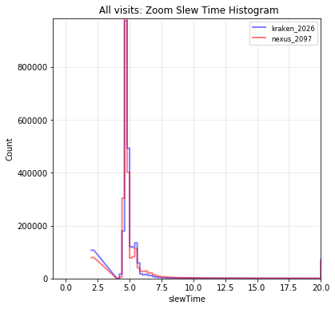
