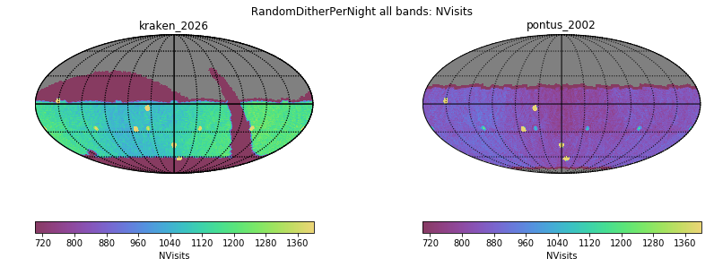
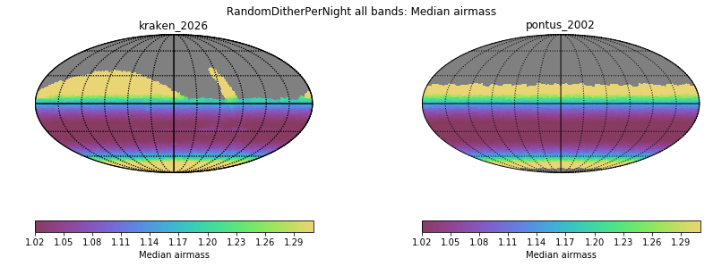
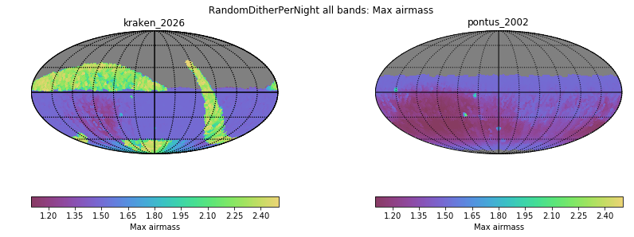
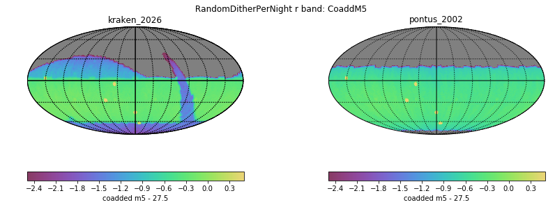
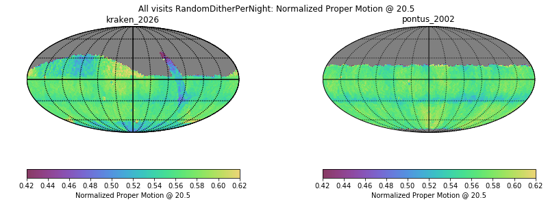
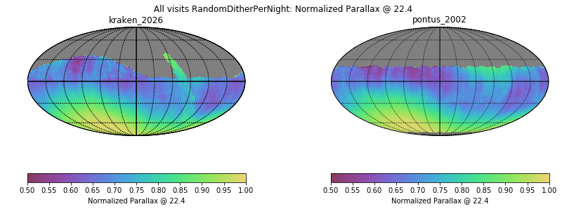
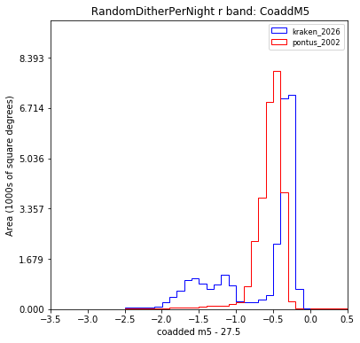
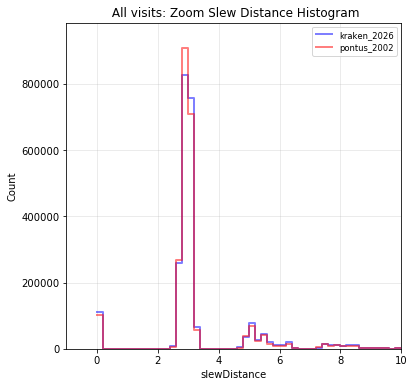
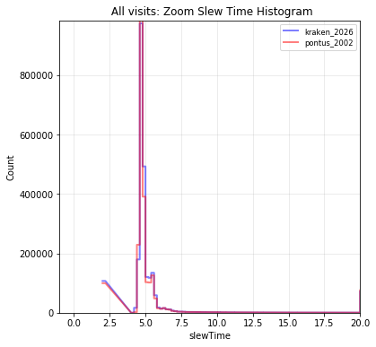

# Table of Contents
1. [fO](#fo)
2. [Total Effective Time](#total-effective-time)
3. [Normalized Effective Time](#normalized-effective-time)
4. [Open Shutter Fraction](#open-shutter-fraction)
5. [Parallax](#parallax)
6. [Proper Motion](#proper-motion)
7. [Rapid Revisit](#rapid-revisit)
8. [Fraction in Pairs](#fraction-in-pairs)
9. [Slews](#slews)
10. [Filter Changes](#filter-changes)
11. [Nvisits](#nvisits)
12. [Proposal Fractions](#proposal-fractions)
13. [Median Nvisits WFD](#median-nvisits-wfd)
14. [Median CoaddM5 WFD](#median-coaddm5-wfd)
15. [Median Airmass WFD](#median-airmass-wfd)
16. [Median Seeing WFD](#median-seeing-wfd)
17. [Skymap comparisons](#skymap-comparisons)
18. [Histrogram comparisons](#histrogram-comparisons)
# fO
|                                                                            |   kraken_2026 |   pontus_2002 |
|:---------------------------------------------------------------------------|--------------:|--------------:|
| fOArea fO All visits RandomDitherPerNight HealpixSlicer                    |     17584     |     18726.3   |
| fOArea/benchmark fO All visits RandomDitherPerNight HealpixSlicer          |         0.977 |         1.04  |
| fONv MedianNvis fO All visits RandomDitherPerNight HealpixSlicer           |      1125     |       860     |
| fONv MinNvis fO All visits RandomDitherPerNight HealpixSlicer              |       644     |       828     |
| fONv/benchmark MedianNvis fO All visits RandomDitherPerNight HealpixSlicer |         1.364 |         1.042 |
| fONv/benchmark MinNvis fO All visits RandomDitherPerNight HealpixSlicer    |         0.781 |         1.004 |
| fOArea fO WFD RandomDitherPerNight HealpixSlicer                           |     17422.9   |     18557.6   |
| fOArea/benchmark fO WFD RandomDitherPerNight HealpixSlicer                 |         0.968 |         1.031 |
| fONv MedianNvis fO WFD RandomDitherPerNight HealpixSlicer                  |      1123     |       860     |
| fONv MinNvis fO WFD RandomDitherPerNight HealpixSlicer                     |       504     |       827     |
| fONv/benchmark MedianNvis fO WFD RandomDitherPerNight HealpixSlicer        |         1.361 |         1.042 |
| fONv/benchmark MinNvis fO WFD RandomDitherPerNight HealpixSlicer           |         0.611 |         1.002 |

# Total Effective Time
|                                               |   kraken_2026 |   pontus_2002 |
|:----------------------------------------------|--------------:|--------------:|
| Total Teff RandomDitherPerNight all bands     |   4.08386e+07 |   3.99238e+07 |
| Total Teff WFD RandomDitherPerNight all bands |   3.68931e+07 |   3.81058e+07 |

# Normalized Effective Time
|                                                                                          |   kraken_2026 |   pontus_2002 |
|:-----------------------------------------------------------------------------------------|--------------:|--------------:|
| Median Normalized Teff RandomDitherPerNight all bands RandomDitherPerNight HealpixSlicer |         0.539 |         0.57  |
| Normalized Teff RandomDitherPerNight all bands RandomDitherPerNight HealpixSlicer        |     32009     |     32487     |
| Normalized Teff RandomDitherPerNight all bands                                           |         0.558 |         0.549 |

# Open Shutter Fraction
|                                                 |   kraken_2026 |   pontus_2002 |
|:------------------------------------------------|--------------:|--------------:|
| OpenShutterFraction All visits                  |         0.735 |         0.733 |
| Median OpenShutterFraction Per night OneDSlicer |         0.739 |         0.736 |
| OpenShutterFraction Per night OneDSlicer        |      3025     |      3025     |

# Parallax
|                                                                                     |   kraken_2026 |   pontus_2002 |
|:------------------------------------------------------------------------------------|--------------:|--------------:|
| Median Parallax Error @ 22.4 All visits RandomDitherPerNight HealpixSlicer          |         1.721 |         1.876 |
| Median Parallax Error @ 24.0 All visits RandomDitherPerNight HealpixSlicer          |         6.718 |         7.329 |
| Median Parallax Coverage @ 22.4 All visits RandomDitherPerNight HealpixSlicer       |         0.556 |         0.558 |
| Median Parallax Coverage @ 24.0 All visits RandomDitherPerNight HealpixSlicer       |         0.552 |         0.554 |
| Median Parallax-DCR degeneracy @ 22.4 All visits RandomDitherPerNight HealpixSlicer |         0.245 |         0.201 |
| Median Parallax-DCR degeneracy @ 24.0 All visits RandomDitherPerNight HealpixSlicer |         0.244 |         0.198 |
| Median Parallax Error @ 22.4 WFD RandomDitherPerNight HealpixSlicer                 |         1.574 |         1.882 |
| Median Parallax Error @ 24.0 WFD RandomDitherPerNight HealpixSlicer                 |         6.108 |         7.35  |
| Median Parallax Coverage @ 22.4 WFD RandomDitherPerNight HealpixSlicer              |         0.559 |         0.559 |
| Median Parallax Coverage @ 24.0 WFD RandomDitherPerNight HealpixSlicer              |         0.555 |         0.555 |
| Median Parallax-DCR degeneracy @ 22.4 WFD RandomDitherPerNight HealpixSlicer        |         0.19  |         0.196 |
| Median Parallax-DCR degeneracy @ 24.0 WFD RandomDitherPerNight HealpixSlicer        |         0.187 |         0.193 |

# Proper Motion
|                                                                                 |   kraken_2026 |   pontus_2002 |
|:--------------------------------------------------------------------------------|--------------:|--------------:|
| Median Proper Motion Error @ 20.5 All visits RandomDitherPerNight HealpixSlicer |         0.156 |         0.179 |
| Median Proper Motion Error @ 24.0 All visits RandomDitherPerNight HealpixSlicer |         1.693 |         1.894 |
| Median Proper Motion Error @ 20.5 WFD RandomDitherPerNight HealpixSlicer        |         0.152 |         0.179 |
| Median Proper Motion Error @ 24.0 WFD RandomDitherPerNight HealpixSlicer        |         1.585 |         1.895 |

# Rapid Revisit
|                                                                           |   kraken_2026 |   pontus_2002 |
|:--------------------------------------------------------------------------|--------------:|--------------:|
| Area (sq deg) RapidRevisits All visits RandomDitherPerNight HealpixSlicer |       28024.8 |       39512   |
| Median RapidRevisits All visits RandomDitherPerNight HealpixSlicer        |           1   |           1   |
| RapidRevisits All visits RandomDitherPerNight HealpixSlicer               |       32009   |       32487   |
| Area (sq deg) RapidRevisits WFD RandomDitherPerNight HealpixSlicer        |       37688.9 |       39477.5 |
| Median RapidRevisits WFD RandomDitherPerNight HealpixSlicer               |           1   |           1   |
| RapidRevisits WFD RandomDitherPerNight HealpixSlicer                      |       22964   |       32482   |

# Fraction in Pairs
|                                                                                               |   kraken_2026 |   pontus_2002 |
|:----------------------------------------------------------------------------------------------|--------------:|--------------:|
| Median Fraction of visits in pairs (15-60 min) gri WFD+NES RandomDitherPerNight HealpixSlicer |         0.878 |         0.883 |
| Median Fraction of visits in pairs (15-60 min) gri RandomDitherPerNight HealpixSlicer         |         0.869 |         0.884 |

# Slews
|                            |   kraken_2026 |   pontus_2002 |
|:---------------------------|--------------:|--------------:|
| Mean slewTime All visits   |         6.789 |         6.948 |
| Median slewTime All visits |         4.792 |         4.776 |
| Min slewTime All visits    |         2     |         2     |
| Max slewTime All visits    |       156     |       156     |

# Filter Changes
|                                                |   kraken_2026 |   pontus_2002 |
|:-----------------------------------------------|--------------:|--------------:|
| Filter Changes Whole Survey                    |     10813     |     10464     |
| Filter Changes Per Night OneDSlicer            |      3025     |      3025     |
| Max Filter Changes Per Night OneDSlicer        |        24     |        25     |
| Mean Filter Changes Per Night OneDSlicer       |         3.177 |         3.08  |
| Median Filter Changes Per Night OneDSlicer     |         2     |         2     |
| Min Filter Changes Per Night OneDSlicer        |         0     |         0     |
| N(+3Sigma) Filter Changes Per Night OneDSlicer |        68     |        59     |
| N(-3Sigma) Filter Changes Per Night OneDSlicer |         0     |         0     |
| Rms Filter Changes Per Night OneDSlicer        |         3.578 |         3.482 |

# Nvisits
|                                     |    kraken_2026 |    pontus_2002 |
|:------------------------------------|---------------:|---------------:|
| Fraction of total Nvisits All props |    1           |    1           |
| Nvisits All props                   |    2.43839e+06 |    2.42548e+06 |
| Median Nvisits All props OneDSlicer |  806           |  804           |
| Nvisits All props OneDSlicer        | 3025           | 3025           |

# Proposal Fractions
|                                                  |   kraken_2026 |   pontus_2002 |
|:-------------------------------------------------|--------------:|--------------:|
| Fraction of total Nvisits All props              |         1     |         1     |
| Fraction of total Nvisits WFD                    |         0.864 |         0.957 |
| Fraction of total Nvisits DeepDrillingCosmology1 |         0.046 |         0.043 |
| Fraction of total Nvisits DD                     |         0.046 |         0.043 |
| Fraction of total Nvisits WideFastDeep           |         0.864 |         0.957 |

# Median Nvisits WFD
|                                                                 |   kraken_2026 |   pontus_2002 |
|:----------------------------------------------------------------|--------------:|--------------:|
| Median NVisits WFD RandomDitherPerNight i band HealpixSlicer    |           242 |           181 |
| Median NVisits WFD RandomDitherPerNight y band HealpixSlicer    |           225 |           171 |
| Median NVisits WFD RandomDitherPerNight z band HealpixSlicer    |           223 |           171 |
| Median NVisits WFD RandomDitherPerNight u band HealpixSlicer    |            76 |            57 |
| Median NVisits WFD RandomDitherPerNight r band HealpixSlicer    |           243 |           182 |
| Median NVisits WFD RandomDitherPerNight all bands HealpixSlicer |          1117 |           843 |
| Median NVisits WFD RandomDitherPerNight g band HealpixSlicer    |           106 |            79 |

# Median CoaddM5 WFD
|                                                              |   kraken_2026 |   pontus_2002 |
|:-------------------------------------------------------------|--------------:|--------------:|
| Median CoaddM5 WFD RandomDitherPerNight i band HealpixSlicer |        26.704 |        26.526 |
| Median CoaddM5 WFD RandomDitherPerNight y band HealpixSlicer |        24.972 |        24.815 |
| Median CoaddM5 WFD RandomDitherPerNight z band HealpixSlicer |        25.796 |        25.636 |
| Median CoaddM5 WFD RandomDitherPerNight u band HealpixSlicer |        25.727 |        25.512 |
| Median CoaddM5 WFD RandomDitherPerNight r band HealpixSlicer |        27.28  |        27.085 |
| Median CoaddM5 WFD RandomDitherPerNight g band HealpixSlicer |        27.224 |        27.019 |

# Median Airmass WFD
|                                                                        |   kraken_2026 |   pontus_2002 |
|:-----------------------------------------------------------------------|--------------:|--------------:|
| Median Median airmass WFD RandomDitherPerNight i band HealpixSlicer    |         1.051 |         1.087 |
| Median Median airmass WFD RandomDitherPerNight y band HealpixSlicer    |         1.086 |         1.093 |
| Median Median airmass WFD RandomDitherPerNight z band HealpixSlicer    |         1.054 |         1.088 |
| Median Median airmass WFD RandomDitherPerNight u band HealpixSlicer    |         1.05  |         1.084 |
| Median Median airmass WFD RandomDitherPerNight r band HealpixSlicer    |         1.049 |         1.086 |
| Median Median airmass WFD RandomDitherPerNight all bands HealpixSlicer |         1.052 |         1.087 |
| Median Median airmass WFD RandomDitherPerNight g band HealpixSlicer    |         1.049 |         1.086 |

# Median Seeing WFD
|                                                                          |   kraken_2026 |   pontus_2002 |
|:-------------------------------------------------------------------------|--------------:|--------------:|
| Median Median seeingEff WFD RandomDitherPerNight i band HealpixSlicer    |         0.828 |         0.835 |
| Median Median seeingEff WFD RandomDitherPerNight y band HealpixSlicer    |         0.807 |         0.805 |
| Median Median seeingEff WFD RandomDitherPerNight z band HealpixSlicer    |         0.813 |         0.818 |
| Median Median seeingEff WFD RandomDitherPerNight u band HealpixSlicer    |         0.946 |         0.982 |
| Median Median seeingEff WFD RandomDitherPerNight r band HealpixSlicer    |         0.854 |         0.868 |
| Median Median seeingEff WFD RandomDitherPerNight all bands HealpixSlicer |         0.837 |         0.842 |
| Median Median seeingEff WFD RandomDitherPerNight g band HealpixSlicer    |         0.893 |         0.922 |

# Skymap comparisons
- [Nvisits all bands](figures/pontus_2002_kraken_2026_NVisits_RandomDitherPerNight_all_bands_HEAL_ComboSkyMap.pdf)

- [Nvisits alt/az all bands](figures/pontus_2002_kraken_2026_Nvisits_as_function_of_Alt_Az_all_bands_HEAL_ComboSkyMap.pdf)

- [Median airmass all bands](figures/pontus_2002_kraken_2026_Median_airmass_RandomDitherPerNight_all_bands_HEAL_ComboSkyMap.pdf)

- [Max airmass all bands](figures/pontus_2002_kraken_2026_Max_airmass_RandomDitherPerNight_all_bands_HEAL_ComboSkyMap.pdf)

- [CoaddM5 r band](figures/pontus_2002_kraken_2026_CoaddM5_RandomDitherPerNight_r_band_HEAL_ComboSkyMap.pdf)

- [Normalized Proper Motion at 20.5](figures/pontus_2002_kraken_2026_Normalized_Proper_Motion_@_20_5_All_visits_RandomDitherPerNight_HEAL_ComboSkyMap.pdf)

- [Normalized Parallax at 22.4](figures/pontus_2002_kraken_2026_Normalized_Parallax_@_22_4_All_visits_RandomDitherPerNight_HEAL_ComboSkyMap.pdf)

# Histrogram comparisons
### CoaddM5 r band HealPix Histrogram

### Slew Distance Histogram

### Zoom Slew Distance Histogram

### Slew Time Histogram

### Zoom Slew Time Histogram 

