# Table of Contents
1. [fO](#fo)
2. [Total Effective Time](#total-effective-time)
3. [Normalized Effective Time](#normalized-effective-time)
4. [Open Shutter Fraction](#open-shutter-fraction)
5. [Parallax](#parallax)
6. [Proper Motion](#proper-motion)
7. [Rapid Revisit](#rapid-revisit)
8. [Fraction in Pairs](#fraction-in-paris)
9. [Slews](#slews)
10. [Filter Changes](#filter-changes)
11. [Nvisits](#nvisits)
12. [Proposal Fractions](#proposal-fractions)
13. [Median Nvisits WFD](#median-nvisits-wfd)
14. [Median CoaddM5 WFD](#median-coaddm5-wfd)
15. [Median Airmass WFD](#median-airmass-wfd)
16. [Median Seeing WFD](#median-seeing-wfd)
17. [Skymap comparisons](#skymap-comparisons)
18. [Histogram comparisons](#histogram-comparisons)
# fO
|                                                       |   kraken_2026 |   pontus_2502 |
|:------------------------------------------------------|--------------:|--------------:|
| fOArea fO All visits HealpixSlicer                    |     18056.6   |      7687.09  |
| fOArea/benchmark fO All visits HealpixSlicer          |         1.003 |         0.427 |
| fONv MedianNvis fO All visits HealpixSlicer           |       940     |       803     |
| fONv MinNvis fO All visits HealpixSlicer              |       857     |       724     |
| fONv/benchmark MedianNvis fO All visits HealpixSlicer |         1.139 |         0.973 |
| fONv/benchmark MinNvis fO All visits HealpixSlicer    |         1.039 |         0.878 |
| fOArea fO WFD HealpixSlicer                           |     18040.6   |      7483.14  |
| fOArea/benchmark fO WFD HealpixSlicer                 |         1.002 |         0.416 |
| fONv MedianNvis fO WFD HealpixSlicer                  |       938     |       801     |
| fONv MinNvis fO WFD HealpixSlicer                     |       857     |       723     |
| fONv/benchmark MedianNvis fO WFD HealpixSlicer        |         1.137 |         0.971 |
| fONv/benchmark MinNvis fO WFD HealpixSlicer           |         1.039 |         0.876 |

# Total Effective Time
|                          |   kraken_2026 |   pontus_2502 |
|:-------------------------|--------------:|--------------:|
| Total Teff all bands     |   4.08386e+07 |   3.52202e+07 |
| Total Teff WFD all bands |   3.68931e+07 |   3.31742e+07 |

# Normalized Effective Time
|                                                    |   kraken_2026 |   pontus_2502 |
|:---------------------------------------------------|--------------:|--------------:|
| Median Normalized Teff WFD all bands HealpixSlicer |         0.584 |         0.576 |
| Normalized Teff WFD all bands HealpixSlicer        |     21495     |     21495     |
| Normalized Teff WFD all bands                      |         0.584 |         0.608 |

# Open Shutter Fraction
|                                                 |   kraken_2026 |   pontus_2502 |
|:------------------------------------------------|--------------:|--------------:|
| OpenShutterFraction All visits                  |         0.735 |         0.717 |
| Median OpenShutterFraction Per night OneDSlicer |         0.739 |         0.732 |
| OpenShutterFraction Per night OneDSlicer        |      3025     |      3019     |

# Parallax
|                                                                |   kraken_2026 |   pontus_2502 |
|:---------------------------------------------------------------|--------------:|--------------:|
| Median Parallax Error @ 22.4 All visits HealpixSlicer          |         1.816 |         2.088 |
| Median Parallax Error @ 24.0 All visits HealpixSlicer          |         7.066 |         8.241 |
| Median Parallax Coverage @ 22.4 All visits HealpixSlicer       |         0.555 |         0.583 |
| Median Parallax Coverage @ 24.0 All visits HealpixSlicer       |         0.551 |         0.576 |
| Median Parallax-DCR degeneracy @ 22.4 All visits HealpixSlicer |         0.237 |         0.293 |
| Median Parallax-DCR degeneracy @ 24.0 All visits HealpixSlicer |         0.235 |         0.29  |
| Median Parallax Error @ 22.4 WFD HealpixSlicer                 |         1.606 |         1.727 |
| Median Parallax Error @ 24.0 WFD HealpixSlicer                 |         6.175 |         6.76  |
| Median Parallax Coverage @ 22.4 WFD HealpixSlicer              |         0.559 |         0.595 |
| Median Parallax Coverage @ 24.0 WFD HealpixSlicer              |         0.555 |         0.59  |
| Median Parallax-DCR degeneracy @ 22.4 WFD HealpixSlicer        |         0.175 |         0.242 |
| Median Parallax-DCR degeneracy @ 24.0 WFD HealpixSlicer        |         0.172 |         0.235 |

# Proper Motion
|                                                            |   kraken_2026 |   pontus_2502 |
|:-----------------------------------------------------------|--------------:|--------------:|
| Median Proper Motion Error @ 20.5 All visits HealpixSlicer |         0.17  |         0.202 |
| Median Proper Motion Error @ 24.0 All visits HealpixSlicer |         1.813 |         2.206 |
| Median Proper Motion Error @ 20.5 WFD HealpixSlicer        |         0.166 |         0.186 |
| Median Proper Motion Error @ 24.0 WFD HealpixSlicer        |         1.677 |         1.92  |

# Rapid Revisit
|                                                      |   kraken_2026 |   pontus_2502 |
|:-----------------------------------------------------|--------------:|--------------:|
| Area (sq deg) RapidRevisits All visits HealpixSlicer |       10178   |       29521.1 |
| Median RapidRevisits All visits HealpixSlicer        |           0   |           1   |
| RapidRevisits All visits HealpixSlicer               |       31116   |       31116   |
| Area (sq deg) RapidRevisits WFD HealpixSlicer        |       10757.1 |       38886.6 |
| Median RapidRevisits WFD HealpixSlicer               |           0   |           1   |
| RapidRevisits WFD HealpixSlicer                      |       21495   |       21495   |

# Fraction in Pairs
|                                                                          |   kraken_2026 |   pontus_2502 |
|:-------------------------------------------------------------------------|--------------:|--------------:|
| Median Fraction of visits in pairs (15-60 min) gri HealpixSlicer         |         0.868 |         0.77  |
| Median Fraction of visits in pairs (15-60 min) gri WFD+NES HealpixSlicer |         0.876 |         0.782 |

# Slews
|                            |   kraken_2026 |   pontus_2502 |
|:---------------------------|--------------:|--------------:|
| Mean slewTime All visits   |         6.789 |         7.856 |
| Median slewTime All visits |         4.792 |         4.774 |
| Min slewTime All visits    |         2     |         2     |
| Max slewTime All visits    |       156     |       156     |

# Filter Changes
|                                                |   kraken_2026 |   pontus_2502 |
|:-----------------------------------------------|--------------:|--------------:|
| Filter Changes Whole Survey                    |     10813     |      8907     |
| Filter Changes Per Night OneDSlicer            |      3025     |      3019     |
| Max Filter Changes Per Night OneDSlicer        |        24     |        28     |
| Mean Filter Changes Per Night OneDSlicer       |         3.177 |         2.547 |
| Median Filter Changes Per Night OneDSlicer     |         2     |         2     |
| Min Filter Changes Per Night OneDSlicer        |         0     |         0     |
| N(+3Sigma) Filter Changes Per Night OneDSlicer |        68     |        78     |
| N(-3Sigma) Filter Changes Per Night OneDSlicer |         0     |         0     |
| Rms Filter Changes Per Night OneDSlicer        |         3.578 |         3.084 |

# Nvisits
|                                     |    kraken_2026 |    pontus_2502 |
|:------------------------------------|---------------:|---------------:|
| Fraction of total Nvisits All props |    1           |    1           |
| Nvisits All props                   |    2.43839e+06 |    2.03382e+06 |
| Median Nvisits All props OneDSlicer |  806           |  721           |
| Nvisits All props OneDSlicer        | 3025           | 3019           |

# Proposal Fractions
|                                                  |   kraken_2026 |   pontus_2502 |
|:-------------------------------------------------|--------------:|--------------:|
| Fraction of total Nvisits All props              |         1     |         1     |
| Fraction of total Nvisits SouthCelestialPole     |         0.02  |         0.026 |
| Fraction of total Nvisits NorthEclipticSpur      |         0.054 |         0.057 |
| Fraction of total Nvisits GalacticPlane          |         0.016 |         0.02  |
| Fraction of total Nvisits WFD                    |         0.864 |         0.894 |
| Fraction of total Nvisits DeepDrillingCosmology1 |         0.046 |         0.003 |
| Fraction of total Nvisits DD                     |         0.046 |         0.003 |
| Fraction of total Nvisits WideFastDeep           |         0.864 |         0.307 |

# Median Nvisits WFD
|                                            |   kraken_2026 |   pontus_2502 |
|:-------------------------------------------|--------------:|--------------:|
| Median NVisits WFD i band HealpixSlicer    |           204 |           168 |
| Median NVisits WFD g band HealpixSlicer    |            90 |            68 |
| Median NVisits WFD y band HealpixSlicer    |           188 |           211 |
| Median NVisits WFD u band HealpixSlicer    |            64 |            49 |
| Median NVisits WFD r band HealpixSlicer    |           206 |           164 |
| Median NVisits WFD z band HealpixSlicer    |           186 |           144 |
| Median NVisits WFD all bands HealpixSlicer |           938 |           801 |

# Median CoaddM5 WFD
|                                         |   kraken_2026 |   pontus_2502 |
|:----------------------------------------|--------------:|--------------:|
| Median CoaddM5 WFD i band HealpixSlicer |        26.618 |        26.487 |
| Median CoaddM5 WFD g band HealpixSlicer |        27.149 |        26.996 |
| Median CoaddM5 WFD y band HealpixSlicer |        24.906 |        24.873 |
| Median CoaddM5 WFD u band HealpixSlicer |        25.651 |        25.437 |
| Median CoaddM5 WFD r band HealpixSlicer |        27.201 |        27.116 |
| Median CoaddM5 WFD z band HealpixSlicer |        25.72  |        25.895 |

# Median Airmass WFD
|                                                   |   kraken_2026 |   pontus_2502 |
|:--------------------------------------------------|--------------:|--------------:|
| Median Median airmass WFD i band HealpixSlicer    |         1.044 |         1.058 |
| Median Median airmass WFD g band HealpixSlicer    |         1.044 |         1.055 |
| Median Median airmass WFD y band HealpixSlicer    |         1.079 |         1.181 |
| Median Median airmass WFD u band HealpixSlicer    |         1.044 |         1.056 |
| Median Median airmass WFD r band HealpixSlicer    |         1.043 |         1.047 |
| Median Median airmass WFD z band HealpixSlicer    |         1.05  |         1.046 |
| Median Median airmass WFD all bands HealpixSlicer |         1.045 |         1.056 |

# Median Seeing WFD
|                                                     |   kraken_2026 |   pontus_2502 |
|:----------------------------------------------------|--------------:|--------------:|
| Median Median seeingEff WFD i band HealpixSlicer    |         0.827 |         0.829 |
| Median Median seeingEff WFD g band HealpixSlicer    |         0.891 |         0.909 |
| Median Median seeingEff WFD y band HealpixSlicer    |         0.805 |         0.871 |
| Median Median seeingEff WFD u band HealpixSlicer    |         0.945 |         0.963 |
| Median Median seeingEff WFD r band HealpixSlicer    |         0.854 |         0.855 |
| Median Median seeingEff WFD z band HealpixSlicer    |         0.811 |         0.801 |
| Median Median seeingEff WFD all bands HealpixSlicer |         0.836 |         0.857 |

# Skymap comparisons
- [Nvisits all bands](figures/kraken_2026_pontus_2502_NVisits_all_bands_HEAL_ComboSkyMap.pdf)
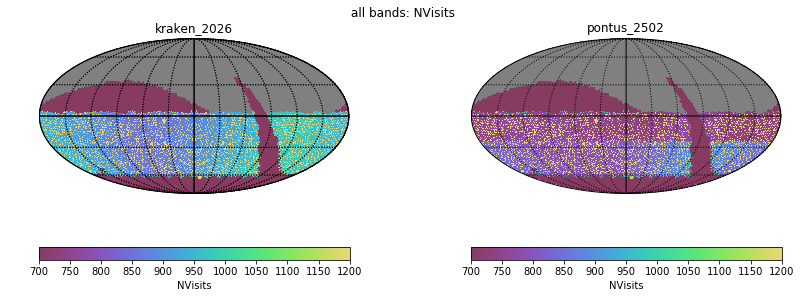
- [Nvisits alt/az all bands](figures/kraken_2026_pontus_2502_Nvisits_as_function_of_Alt_Az_all_bands_HEAL_ComboSkyMap.pdf)
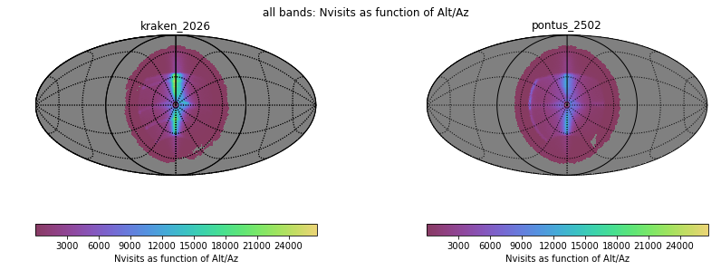
- [Median airmass all bands](figures/kraken_2026_pontus_2502_Median_airmass_all_bands_HEAL_ComboSkyMap.pdf)
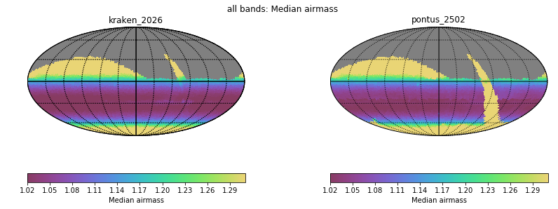
- [Max airmass all bands](figures/kraken_2026_pontus_2502_Max_airmass_all_bands_HEAL_ComboSkyMap.pdf)
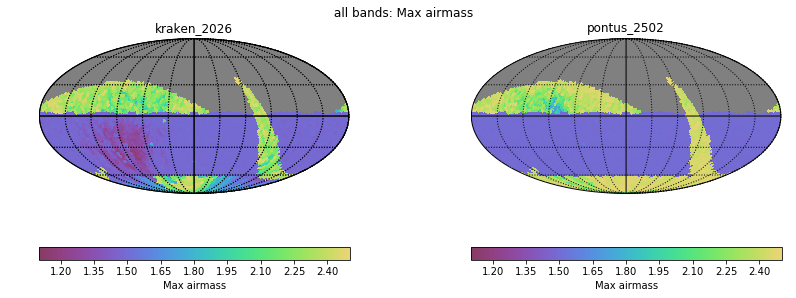
- [CoaddM5 r band](figures/kraken_2026_pontus_2502_CoaddM5_r_band_HEAL_ComboSkyMap.pdf)
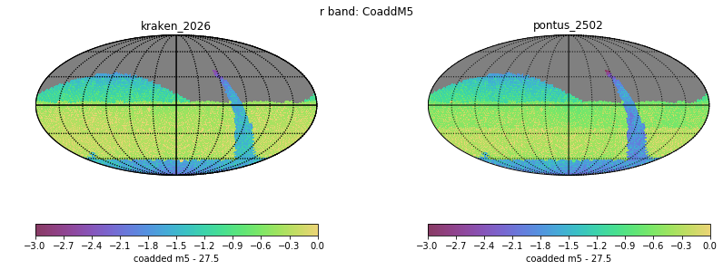
- [Normalized Proper Motion at 20.5](figures/kraken_2026_pontus_2502_Normalized_Proper_Motion_@_20_5_All_visits_HEAL_ComboSkyMap.pdf)
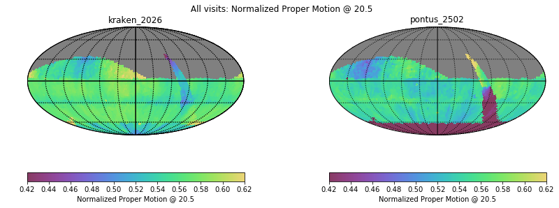
- [Normalized Parallax at 22.4](figures/kraken_2026_pontus_2502_Normalized_Parallax_@_22_4_All_visits_HEAL_ComboSkyMap.pdf)
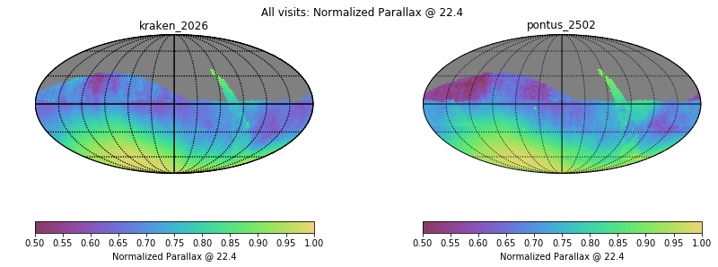
# Histogram comparisons
### CoaddM5 r band HealPix Histogram
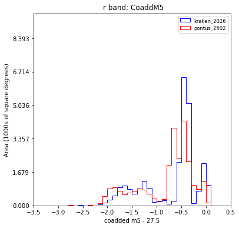
### Slew Distance Histogram
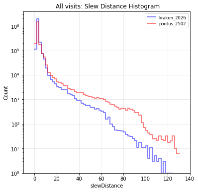
### Zoom Slew Distance Histogram
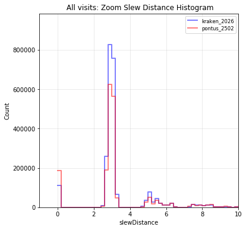
### Slew Time Histogram
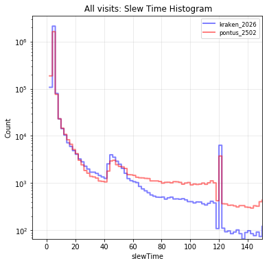
### Zoom Slew Time Histogram 
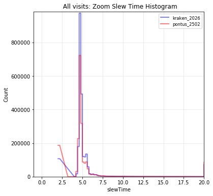
