# Table of Contents
1. [fO](#fo)
2. [Total Effective Time](#total-effective-time)
3. [Normalized Effective Time](#normalized-effective-time)
4. [Open Shutter Fraction](#open-shutter-fraction)
5. [Parallax](#parallax)
6. [Proper Motion](#proper-motion)
7. [Rapid Revisit](#rapid-revisit)
8. [Fraction in Pairs](#fraction-in-paris)
9. [Slews](#slews)
10. [Filter Changes](#filter-changes)
11. [Nvisits](#nvisits)
12. [Proposal Fractions](#proposal-fractions)
13. [Median Nvisits WFD](#median-nvisits-wfd)
14. [Median CoaddM5 WFD](#median-coaddm5-wfd)
15. [Median FiveSigmaDepth](#median-fivesigmadepth)
16. [Median Internight Gap](#median-internight-gap)
17. [Median Airmass WFD](#median-airmass-wfd)
18. [Median Seeing WFD](#median-seeing-wfd)
19. [Skymap comparisons](#skymap-comparisons)
20. [Histogram comparisons](#histogram-comparisons)
# fO
|                                                       |   pontus_2002 |   kraken_2044 |
|:------------------------------------------------------|--------------:|--------------:|
| fOArea fO All visits HealpixSlicer                    |      6061.38  |      6061.38  |
| fOArea/benchmark fO All visits HealpixSlicer          |         0.337 |         0.337 |
| fONv MedianNvis fO All visits HealpixSlicer           |       713     |       719     |
| fONv MinNvis fO All visits HealpixSlicer              |       682     |       688     |
| fONv/benchmark MedianNvis fO All visits HealpixSlicer |         0.864 |         0.872 |
| fONv/benchmark MinNvis fO All visits HealpixSlicer    |         0.827 |         0.834 |
| fOArea fO WFD HealpixSlicer                           |      6028.65  |      6028.65  |
| fOArea/benchmark fO WFD HealpixSlicer                 |         0.335 |         0.335 |
| fONv MedianNvis fO WFD HealpixSlicer                  |       713     |       719     |
| fONv MinNvis fO WFD HealpixSlicer                     |       682     |       688     |
| fONv/benchmark MedianNvis fO WFD HealpixSlicer        |         0.864 |         0.872 |
| fONv/benchmark MinNvis fO WFD HealpixSlicer           |         0.827 |         0.834 |

# Total Effective Time
|                          |   pontus_2002 |   kraken_2044 |
|:-------------------------|--------------:|--------------:|
| Total Teff all bands     |   3.99238e+07 |   3.99424e+07 |
| Total Teff WFD all bands |   3.81058e+07 |   3.81273e+07 |

# Normalized Effective Time
|                                                    |   pontus_2002 |   kraken_2044 |
|:---------------------------------------------------|--------------:|--------------:|
| Median Normalized Teff WFD all bands HealpixSlicer |         0.575 |         0.57  |
| Normalized Teff WFD all bands HealpixSlicer        |     31568     |     31568     |
| Normalized Teff WFD all bands                      |         0.547 |         0.543 |

# Open Shutter Fraction
|                                                 |   pontus_2002 |   kraken_2044 |
|:------------------------------------------------|--------------:|--------------:|
| OpenShutterFraction All visits                  |         0.733 |         0.74  |
| Median OpenShutterFraction Per night OneDSlicer |         0.736 |         0.743 |
| OpenShutterFraction Per night OneDSlicer        |      3025     |      3025     |

# Parallax
|                                                                |   pontus_2002 |   kraken_2044 |
|:---------------------------------------------------------------|--------------:|--------------:|
| Median Parallax Error @ 22.4 All visits HealpixSlicer          |         1.955 |         1.964 |
| Median Parallax Error @ 24.0 All visits HealpixSlicer          |         7.613 |         7.696 |
| Median Parallax Coverage @ 22.4 All visits HealpixSlicer       |         0.559 |         0.583 |
| Median Parallax Coverage @ 24.0 All visits HealpixSlicer       |         0.555 |         0.579 |
| Median Parallax-DCR degeneracy @ 22.4 All visits HealpixSlicer |         0.194 |         0.252 |
| Median Parallax-DCR degeneracy @ 24.0 All visits HealpixSlicer |         0.19  |         0.252 |
| Median Parallax Error @ 22.4 WFD HealpixSlicer                 |         1.959 |         1.964 |
| Median Parallax Error @ 24.0 WFD HealpixSlicer                 |         7.623 |         7.7   |
| Median Parallax Coverage @ 22.4 WFD HealpixSlicer              |         0.559 |         0.583 |
| Median Parallax Coverage @ 24.0 WFD HealpixSlicer              |         0.555 |         0.579 |
| Median Parallax-DCR degeneracy @ 22.4 WFD HealpixSlicer        |         0.194 |         0.252 |
| Median Parallax-DCR degeneracy @ 24.0 WFD HealpixSlicer        |         0.19  |         0.252 |

# Proper Motion
|                                                            |   pontus_2002 |   kraken_2044 |
|:-----------------------------------------------------------|--------------:|--------------:|
| Median Proper Motion Error @ 20.5 All visits HealpixSlicer |         0.194 |         0.193 |
| Median Proper Motion Error @ 24.0 All visits HealpixSlicer |         1.993 |         2.022 |
| Median Proper Motion Error @ 20.5 WFD HealpixSlicer        |         0.194 |         0.193 |
| Median Proper Motion Error @ 24.0 WFD HealpixSlicer        |         1.994 |         2.023 |

# Rapid Revisit
|                                                      |   pontus_2002 |   kraken_2044 |
|:-----------------------------------------------------|--------------:|--------------:|
| Area (sq deg) RapidRevisits All visits HealpixSlicer |       9533.08 |       9437.69 |
| Median RapidRevisits All visits HealpixSlicer        |          0    |          0    |
| RapidRevisits All visits HealpixSlicer               |      31568    |      31568    |
| Area (sq deg) RapidRevisits WFD HealpixSlicer        |       9482.12 |       9386.72 |
| Median RapidRevisits WFD HealpixSlicer               |          0    |          0    |
| RapidRevisits WFD HealpixSlicer                      |      31568    |      31568    |

# Fraction in Pairs
|                                                                          |   pontus_2002 |   kraken_2044 |
|:-------------------------------------------------------------------------|--------------:|--------------:|
| Median Fraction of visits in pairs (15-60 min) gri HealpixSlicer         |         0.884 |             0 |
| Median Fraction of visits in pairs (15-60 min) gri WFD+NES HealpixSlicer |         0.883 |             0 |

# Slews
|                            |   pontus_2002 |   kraken_2044 |
|:---------------------------|--------------:|--------------:|
| Mean slewTime All visits   |         6.948 |         6.515 |
| Median slewTime All visits |         4.776 |         4.776 |
| Min slewTime All visits    |         2     |         2     |
| Max slewTime All visits    |       156     |       156     |

# Filter Changes
|                                                |   pontus_2002 |   kraken_2044 |
|:-----------------------------------------------|--------------:|--------------:|
| Filter Changes Whole Survey                    |     10464     |     10364     |
| Filter Changes Per Night OneDSlicer            |      3025     |      3025     |
| Max Filter Changes Per Night OneDSlicer        |        25     |        23     |
| Mean Filter Changes Per Night OneDSlicer       |         3.08  |         3.05  |
| Median Filter Changes Per Night OneDSlicer     |         2     |         2     |
| Min Filter Changes Per Night OneDSlicer        |         0     |         0     |
| N(+3Sigma) Filter Changes Per Night OneDSlicer |        59     |        64     |
| N(-3Sigma) Filter Changes Per Night OneDSlicer |         0     |         0     |
| Rms Filter Changes Per Night OneDSlicer        |         3.482 |         3.271 |

# Nvisits
|                                     |    pontus_2002 |    kraken_2044 |
|:------------------------------------|---------------:|---------------:|
| Fraction of total Nvisits All props |    1           |    1           |
| Nvisits All props                   |    2.42548e+06 |    2.45161e+06 |
| Median Nvisits All props OneDSlicer |  804           |  809           |
| Nvisits All props OneDSlicer        | 3025           | 3025           |

# Proposal Fractions
|                                                  |   pontus_2002 |   kraken_2044 |
|:-------------------------------------------------|--------------:|--------------:|
| Fraction of total Nvisits All props              |         1     |         1     |
| Fraction of total Nvisits WFD                    |         0.957 |         0.956 |
| Fraction of total Nvisits WideFastDeep           |         0.957 |         0.956 |
| Fraction of total Nvisits DeepDrillingCosmology1 |         0.043 |         0.045 |
| Fraction of total Nvisits DD                     |         0.043 |         0.045 |

# Median Nvisits WFD
|                                            |   pontus_2002 |   kraken_2044 |
|:-------------------------------------------|--------------:|--------------:|
| Median NVisits WFD u band HealpixSlicer    |            47 |            46 |
| Median NVisits WFD y band HealpixSlicer    |           142 |           142 |
| Median NVisits WFD z band HealpixSlicer    |           142 |           147 |
| Median NVisits WFD g band HealpixSlicer    |            66 |            67 |
| Median NVisits WFD all bands HealpixSlicer |           696 |           702 |
| Median NVisits WFD i band HealpixSlicer    |           150 |           151 |
| Median NVisits WFD r band HealpixSlicer    |           151 |           152 |

# Median CoaddM5 WFD
|                                         |   pontus_2002 |   kraken_2044 |
|:----------------------------------------|--------------:|--------------:|
| Median CoaddM5 WFD u band HealpixSlicer |        25.453 |        25.453 |
| Median CoaddM5 WFD y band HealpixSlicer |        24.745 |        24.725 |
| Median CoaddM5 WFD z band HealpixSlicer |        25.569 |        25.586 |
| Median CoaddM5 WFD g band HealpixSlicer |        26.958 |        26.938 |
| Median CoaddM5 WFD i band HealpixSlicer |        26.455 |        26.466 |
| Median CoaddM5 WFD r band HealpixSlicer |        27.016 |        27.016 |

# Median FiveSigmaDepth
|                                                          |   pontus_2002 |   kraken_2044 |
|:---------------------------------------------------------|--------------:|--------------:|
| Median Median fiveSigmaDepth WFD u band HealpixSlicer    |        23.283 |        23.292 |
| Median Median fiveSigmaDepth WFD y band HealpixSlicer    |        22.006 |        21.975 |
| Median Median fiveSigmaDepth WFD z band HealpixSlicer    |        22.785 |        22.798 |
| Median Median fiveSigmaDepth WFD g band HealpixSlicer    |        24.611 |        24.602 |
| Median Median fiveSigmaDepth WFD all bands HealpixSlicer |        23.457 |        23.452 |
| Median Median fiveSigmaDepth WFD i band HealpixSlicer    |        23.681 |        23.692 |
| Median Median fiveSigmaDepth WFD r band HealpixSlicer    |        24.236 |        24.24  |

# Median Internight Gap
|                                                           |   pontus_2002 |   kraken_2044 |
|:----------------------------------------------------------|--------------:|--------------:|
| Median Median Inter-Night Gap WFD u band HealpixSlicer    |        26.926 |        25.932 |
| Median Median Inter-Night Gap WFD y band HealpixSlicer    |         4.992 |         4.012 |
| Median Median Inter-Night Gap WFD z band HealpixSlicer    |        18.95  |         2.979 |
| Median Median Inter-Night Gap WFD g band HealpixSlicer    |        32.908 |        17.94  |
| Median Median Inter-Night Gap WFD i band HealpixSlicer    |        13.438 |         6.484 |
| Median Median Inter-Night Gap WFD r band HealpixSlicer    |        13.967 |         3.999 |
| Median Median Inter-Night Gap WFD all bands HealpixSlicer |         1.994 |         1.057 |

# Median Airmass WFD
|                                                   |   pontus_2002 |   kraken_2044 |
|:--------------------------------------------------|--------------:|--------------:|
| Median Median airmass WFD u band HealpixSlicer    |         1.079 |         1.081 |
| Median Median airmass WFD y band HealpixSlicer    |         1.086 |         1.09  |
| Median Median airmass WFD z band HealpixSlicer    |         1.082 |         1.094 |
| Median Median airmass WFD g band HealpixSlicer    |         1.081 |         1.082 |
| Median Median airmass WFD all bands HealpixSlicer |         1.081 |         1.083 |
| Median Median airmass WFD i band HealpixSlicer    |         1.081 |         1.083 |
| Median Median airmass WFD r band HealpixSlicer    |         1.08  |         1.081 |

# Median Seeing WFD
|                                                     |   pontus_2002 |   kraken_2044 |
|:----------------------------------------------------|--------------:|--------------:|
| Median Median seeingEff WFD u band HealpixSlicer    |         0.979 |         0.968 |
| Median Median seeingEff WFD y band HealpixSlicer    |         0.802 |         0.82  |
| Median Median seeingEff WFD z band HealpixSlicer    |         0.816 |         0.817 |
| Median Median seeingEff WFD g band HealpixSlicer    |         0.92  |         0.921 |
| Median Median seeingEff WFD all bands HealpixSlicer |         0.84  |         0.844 |
| Median Median seeingEff WFD i band HealpixSlicer    |         0.833 |         0.828 |
| Median Median seeingEff WFD r band HealpixSlicer    |         0.865 |         0.866 |

# Skymap comparisons
- [Nvisits all bands](figures/kraken_2044_pontus_2002_NVisits_all_bands_HEAL_ComboSkyMap.pdf)
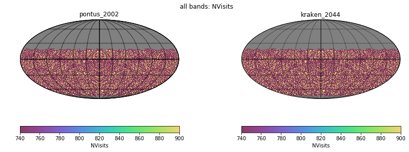
- [Nvisits alt/az all bands](figures/kraken_2044_pontus_2002_Nvisits_as_function_of_Alt_Az_all_bands_HEAL_ComboSkyMap.pdf)
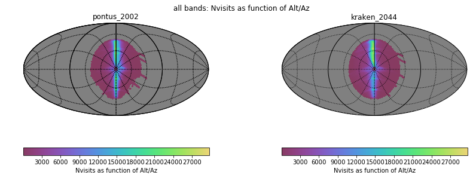
- [Median airmass all bands](figures/kraken_2044_pontus_2002_Median_airmass_all_bands_HEAL_ComboSkyMap.pdf)
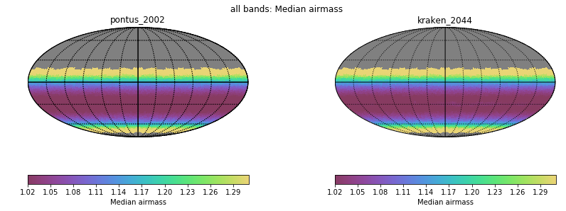
- [Max airmass all bands](figures/kraken_2044_pontus_2002_Max_airmass_all_bands_HEAL_ComboSkyMap.pdf)
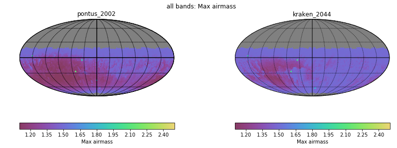
- [CoaddM5 r band](figures/kraken_2044_pontus_2002_CoaddM5_r_band_HEAL_ComboSkyMap.pdf)
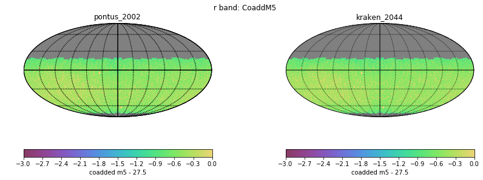
- [Normalized Proper Motion at 20.5](figures/kraken_2044_pontus_2002_Normalized_Proper_Motion_@_20_5_All_visits_HEAL_ComboSkyMap.pdf)
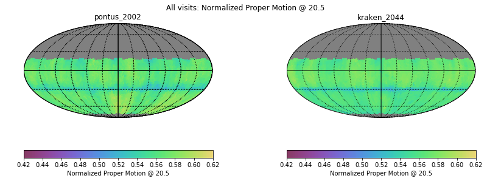
- [Normalized Parallax at 22.4](figures/kraken_2044_pontus_2002_Normalized_Parallax_@_22_4_All_visits_HEAL_ComboSkyMap.pdf)
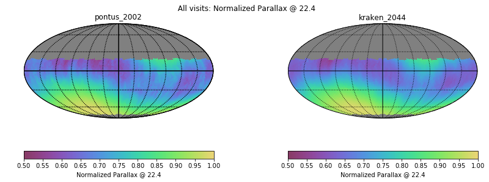
# Histogram comparisons
### CoaddM5 r band HealPix Histogram
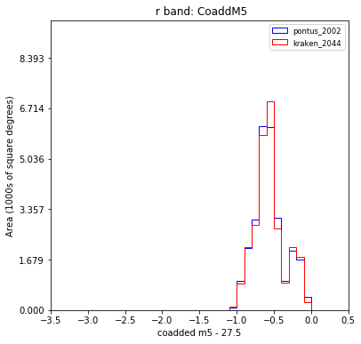
### Slew Distance Histogram
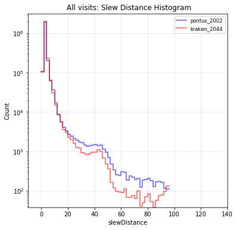
### Zoom Slew Distance Histogram
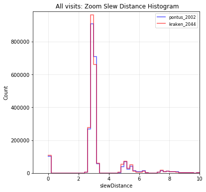
### Slew Time Histogram
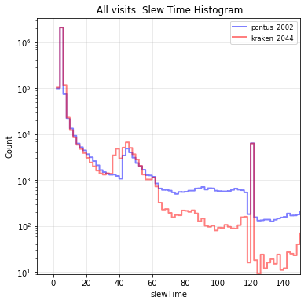
### Zoom Slew Time Histogram 
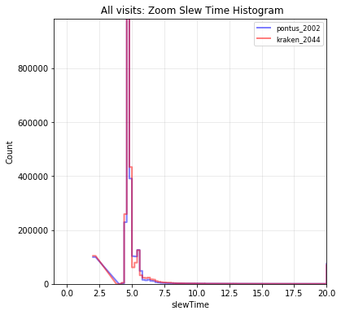
